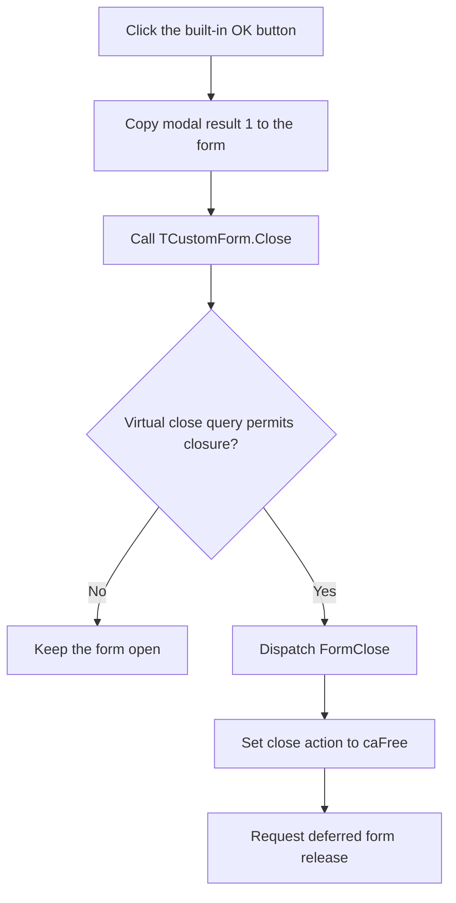

# btnOK

> Analysis status: Source reviewed. The modeless close and release path is documented.

## Control

| Property | Recovered value |
| --- | --- |
| Form | frmMatrixError |
| Component path | frmMatrixError.btnOK |
| Control class | TBitBtn |
| Caption | Not present in the recovered resource. |
| Hint | Not present in the recovered resource. |
| Text | Not present in the recovered resource. |
| Handler name | btnOKClick |
| Handler address | 00c88100 |
| Graph node | `resource:dfm:frmMatrixError/frmMatrixError.btnOK` |
| Handler node | `function:00c88100` |
| Graph layer | UI |

## What happens when clicked

`btnOK` asks the Matrix Error form to close. The standard `bkOK` button path
first writes modal result `1` to the parent form and then dispatches the custom
handler. The recovered handler calls only the shared `TCustomForm.Close`
implementation.

Both recovered callers create this dialog and call `TCustomForm.Show`, which
makes and activates a modeless form. The close routine therefore runs its
modeless path. It first calls the form's virtual close-query method. If the
query rejects closure, it returns and keeps the form open. If the query permits
closure, it dispatches `FormClose`. This form handler changes the close action
to value `2`, the Delphi `caFree` action. The close routine then calls the
deferred form-release path.

The handler does not validate data. It does not change the error summary or
the text in `memoError`. It has no local error branch. A rejected virtual close
query is the only proven no-close branch. No form-specific `OnCloseQuery`
binding is present in the recovered resource.

## Click flow

## Handler evidence

- Source: [DecompiledSources/Tina16/functions/0000000000C88100__FUN_00c88100.c](../../../DecompiledSources/Tina16/functions/0000000000C88100__FUN_00c88100.c)
- Recovered role: Matrix Error modeless close handler.
- Current graph summary: Handles 1 Delphi UI event: frmMatrixError.btnOK.OnClick.
- Behavior: Calls the shared form-close routine. The recovered modeless path
  checks whether closure is permitted, dispatches `FormClose`, and uses that
  handler's `caFree` action to request deferred release.
- Evidence: The handler source contains only a call to `FUN_00805200`. That
  shared routine runs its virtual close query and close-action dispatch for a
  modeless form. `FormClose` at `00C880C0` writes action value `2`, which selects
  the release call. Callers `FUN_016fda80` and `FUN_016fe2a0` create
  `TfrmMatrixError` and pass it to `FUN_008059a0`, the annotated
  `TCustomForm.Show` function.
- Complexity: simple
- Distinct outgoing calls: 1

## Direct calls

- `function:00805200` — runs `TCustomForm.Close`, including the modal-result
  branch and the modeless close-query and close-action branches.

## Resource evidence

- Kind: bkOK
- Modal result: Not present in the recovered resource.
- Checked state: Not present in the recovered resource.
- List items: Not present in the recovered resource.
- Image reference: Not present in the recovered resource.
- Extracted glyph: None.

## Nearby label candidates

Nearby labels are layout candidates only. They are not proof of behavior.

- No same-parent label candidate is available.

## Analysis limits

- `bkOK` supplies modal result `1` through the recovered VCL kind and click
  paths. This dialog is modeless, so that value does not end a modal loop. The
  custom handler's explicit close request controls the observed lifetime path.
- A class can override the virtual close-query method without a DFM event. The
  recovered graph does not resolve a `TfrmMatrixError` override, so the article
  keeps the possible rejection branch explicit and does not invent a reason.
- The knowledge-graph JSON export was absent during review. The same graph node,
  edge, layer, annotation, and resource checks used the canonical DuckDB graph.
