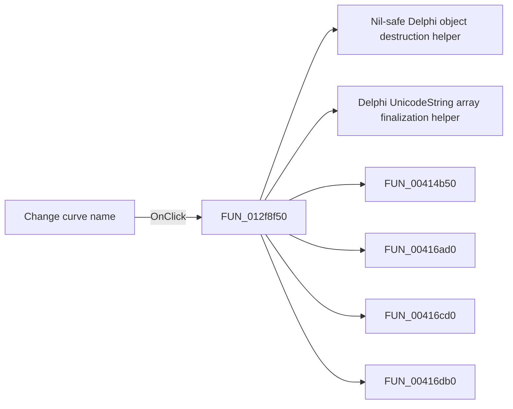

# Change curve name

> Analysis status: Pending individual source review.

## Control

| Property | Recovered value |
| --- | --- |
| Form | frmModelTestBenchEditor |
| Component path | frmModelTestBenchEditor.pnlMain.pnlTestOptions.grB_localSettings.pctrl_localSettingst.ts_manage.btn_changeCurveName |
| Control class | TButton |
| Caption | Change curve name |
| Hint | Only available in AC curve mode. |
| Text | Not present in the recovered resource. |
| Handler name | btn_changeCurveNameClick |
| Handler address | 012f8f50 |
| Graph node | `resource:dfm:frmModelTestBenchEditor/frmModelTestBenchEditor.pnlMain.pnlTestOptions.grB_localSettings.pctrl_localSettingst.ts_manage.btn_changeCurveName` |
| Handler node | `function:012f8f50` |
| Graph layer | UI |

## What happens when clicked

Pending individual analysis. An agent must read the recovered handler source and its relevant callees before it replaces this text.

## Click flow

## Handler evidence

- Source: [DecompiledSources/Tina16/functions/00000000012F8F50__FUN_012f8f50.c](../../../DecompiledSources/Tina16/functions/00000000012F8F50__FUN_012f8f50.c)
- Recovered role: Not present in the recovered resource.
- Current graph summary: Handles 1 Delphi UI event: frmModelTestBenchEditor.pnlMain.pnlTestOptions.grB_localSettings.pctrl_localSettingst.ts_manage.btn_changeCurveName.OnClick.
- Current graph behavior: Not present in the recovered resource.
- Current graph evidence: Not present in the recovered resource.
- Complexity: complex
- Distinct outgoing calls: 34

## Direct calls

- `function:00410f20` — Nil-safe Delphi object destruction helper
- `function:00414560` — Delphi UnicodeString array finalization helper
- `function:00414b50` — FUN_00414b50
- `function:00416ad0` — FUN_00416ad0
- `function:00416cd0` — FUN_00416cd0
- `function:00416db0` — FUN_00416db0
- `function:00417580` — FUN_00417580
- `function:00417740` — FUN_00417740
- `function:00440a20` — FUN_00440a20
- `function:004aeac0` — FUN_004aeac0
- `function:004b9860` — Delphi file-stream constructor wrapper
- `function:0064dd90` — VCL control Unicode text reader
- `function:006dd390` — FUN_006dd390
- `function:006dd6f0` — FUN_006dd6f0
- `function:006e2530` — FUN_006e2530
- `function:0072d730` — FUN_0072d730
- `function:007fc180` — FUN_007fc180
- `function:00b047e0` — FUN_00b047e0
- `function:012e5c80` — FUN_012e5c80
- `function:012e5d00` — FUN_012e5d00
- `function:012e5d70` — FUN_012e5d70
- `function:012e6020` — FUN_012e6020
- `function:012e68a0` — FUN_012e68a0
- `function:01304bb0` — FUN_01304bb0
- `function:013056e0` — FUN_013056e0
- `function:0130d680` — FUN_0130d680
- `function:01cc09f0` — FUN_01cc09f0
- `function:01cc3bb0` — FUN_01cc3bb0
- `function:01d30b30` — FUN_01d30b30
- `function:01d30e90` — FUN_01d30e90
- `function:01d30f00` — FUN_01d30f00
- `function:01d317c0` — FUN_01d317c0
- `function:01d31a40` — FUN_01d31a40
- `function:01d347d0` — FUN_01d347d0

## Resource evidence

- Kind: Not present in the recovered resource.
- Modal result: Not present in the recovered resource.
- Checked state: Not present in the recovered resource.
- List items: Not present in the recovered resource.
- Image reference: Not present in the recovered resource.
- Extracted glyph: None.

## Nearby label candidates

Nearby labels are layout candidates only. They are not proof of behavior.

- No same-parent label candidate is available.

## Analysis limits

- Do not infer behavior from the control class, caption, hint, glyph, or nearby label alone.
- Do not replace the pending status until the handler source and relevant call path provide enough evidence.
