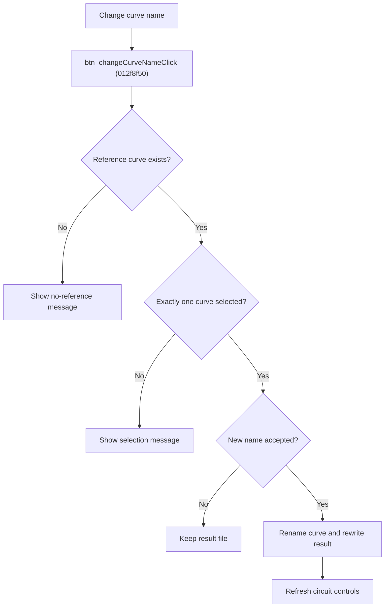

# Change Reference Curve Name

> Analysis status: Source reviewed for `TIARA-diz.6.7.1962`.

## Control

| Property | Recovered value |
| --- | --- |
| Form | frmModelTestBenchEditor |
| Component path | frmModelTestBenchEditor.pnlMain.pnlTestOptions.grB_localSettings.pctrl_localSettingst.ts_manage.btn_changeCurveName |
| Control class | TButton |
| Caption | Change curve name |
| Hint | See Resource evidence below. |
| Handler name | btn_changeCurveNameClick |
| Handler address | 012f8f50 |
| Graph node | `resource:dfm:frmModelTestBenchEditor/frmModelTestBenchEditor.pnlMain.pnlTestOptions.grB_localSettings.pctrl_localSettingst.ts_manage.btn_changeCurveName` |
| Handler node | `function:012f8f50` |
| Graph layer | UI |

## What happens when clicked

- Requires the current circuit to have reference-curve data. Otherwise shows `There is no reference curve to this circuit.`
- Requires reference CURVE selection and exactly one checked curve. It shows a specific message when the selection is missing or has more than one curve.
- Gets a new curve name through a helper dialog. If no name is returned, it does not rewrite the file.
- Loads the circuit's simulation-specific `.refresult` file, updates the selected curve name, writes the changed result, then refreshes the current circuit controls.
- The resource hint limits this feature to AC curve mode; the recovered handler also derives the result extension from the active simulation type.

## Click flow

## Handler evidence

- Source: [FUN_012f8f50](../../../DecompiledSources/Tina16/functions/00000000012F8F50__FUN_012f8f50.c)
- Recovered role: Rename the one selected reference curve in its result file.
- FUN_012f8f50 checks reference data and checked-curve count before it creates the name dialog.
- It builds the result path from Result folder, circuit path, simulation format, and `.refresult`, then reads, changes, and writes the result structure.
- The handler contains messages for no curve, no checked curve, and more than one checked curve.

## Resource evidence

- Caption: `Change curve name`.
- No extracted glyph is present for this control.
- Nearby labels, when cited above, are candidates from the same parent and are used only with handler evidence.

## Analysis limits

- No runtime UI test was performed.
- The explanation does not infer behavior from the caption, hint, or nearby labels alone.
