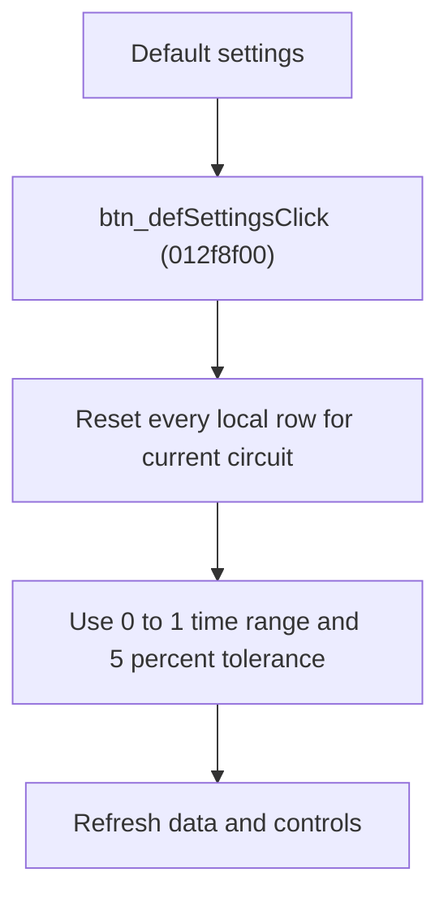

# Default Local Settings

> Analysis status: Source reviewed for `TIARA-diz.6.7.1963`.

## Control

| Property | Recovered value |
| --- | --- |
| Form | frmModelTestBenchEditor |
| Component path | frmModelTestBenchEditor.pnlMain.pnlTestOptions.grB_localSettings.pctrl_localSettingst.ts_manage.btn_defSettings |
| Control class | TButton |
| Caption | Default settings |
| Hint | See Resource evidence below. |
| Handler name | btn_defSettingsClick |
| Handler address | 012f8f00 |
| Graph node | `resource:dfm:frmModelTestBenchEditor/frmModelTestBenchEditor.pnlMain.pnlTestOptions.grB_localSettings.pctrl_localSettingst.ts_manage.btn_defSettings` |
| Handler node | `function:012f8f00` |
| Graph layer | UI |

## What happens when clicked

- Resets every local comparison row for the current circuit.
- The recovered defaults clear reference selection and comparison flags, set start time to 0, end time to 1, and tolerance to 5.
- Refreshes the current circuit's data display and local-setting controls.
- If there is no record list, the reset helper returns without changing state.

## Click flow

## Handler evidence

- Source: [FUN_012f8f00](../../../DecompiledSources/Tina16/functions/00000000012F8F00__FUN_012f8f00.c)
- Recovered role: Reset all local comparison rows for the current circuit.
- FUN_012f8f00 calls FUN_013063e0 with mode 1, then refreshes the selected node and controls.
- FUN_013063e0 mode 1 selects the current circuit record and writes the recovered defaults for every local row.
- Relevant callee: [FUN_013063e0](../../../DecompiledSources/Tina16/functions/00000000013063E0__FUN_013063e0.c)

## Resource evidence

- Caption: `Default settings`.
- No extracted glyph is present for this control.
- Nearby labels, when cited above, are candidates from the same parent and are used only with handler evidence.

## Analysis limits

- No runtime UI test was performed.
- The explanation does not infer behavior from the caption, hint, or nearby labels alone.
