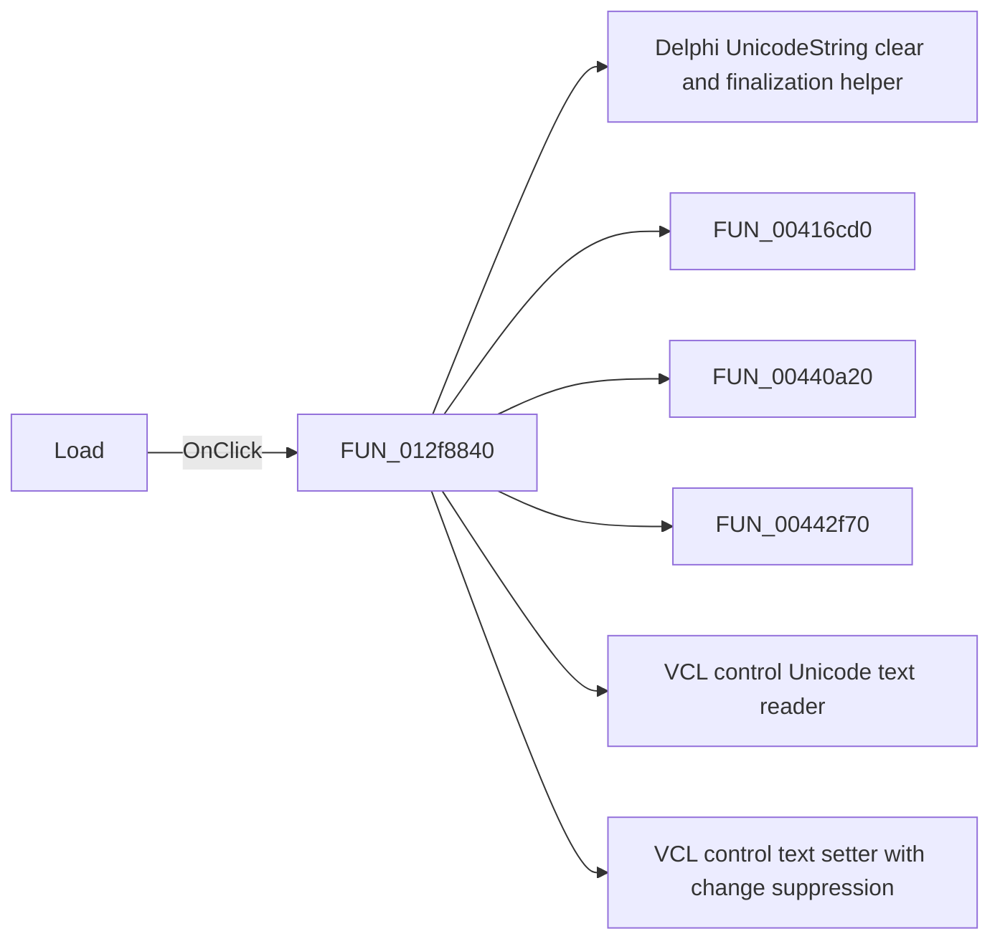

# Load

> Analysis status: Pending individual source review.

## Control

| Property | Recovered value |
| --- | --- |
| Form | frmModelTestBenchEditor |
| Component path | frmModelTestBenchEditor.pnlMain.pnlTestOptions.grB_references.btn_loadRef |
| Control class | TButton |
| Caption | Load |
| Hint | Not present in the recovered resource. |
| Text | Not present in the recovered resource. |
| Handler name | btn_loadRefClick |
| Handler address | 012f8840 |
| Graph node | `resource:dfm:frmModelTestBenchEditor/frmModelTestBenchEditor.pnlMain.pnlTestOptions.grB_references.btn_loadRef` |
| Handler node | `function:012f8840` |
| Graph layer | UI |

## What happens when clicked

Pending individual analysis. An agent must read the recovered handler source and its relevant callees before it replaces this text.

## Click flow

## Handler evidence

- Source: [DecompiledSources/Tina16/functions/00000000012F8840__FUN_012f8840.c](../../../DecompiledSources/Tina16/functions/00000000012F8840__FUN_012f8840.c)
- Recovered role: Not present in the recovered resource.
- Current graph summary: Handles 1 Delphi UI event: frmModelTestBenchEditor.pnlMain.pnlTestOptions.grB_references.btn_loadRef.OnClick.
- Current graph behavior: Not present in the recovered resource.
- Current graph evidence: Not present in the recovered resource.
- Complexity: complex
- Distinct outgoing calls: 12

## Direct calls

- `function:00414480` — Delphi UnicodeString clear and finalization helper
- `function:00416cd0` — FUN_00416cd0
- `function:00440a20` — FUN_00440a20
- `function:00442f70` — FUN_00442f70
- `function:0064dd90` — VCL control Unicode text reader
- `function:0064de00` — VCL control text setter with change suppression
- `function:006e2530` — FUN_006e2530
- `function:0072d730` — FUN_0072d730
- `function:007fc180` — FUN_007fc180
- `function:008059a0` — FUN_008059a0
- `function:012e2da0` — FUN_012e2da0
- `function:01301c40` — FUN_01301c40

## Resource evidence

- Kind: Not present in the recovered resource.
- Modal result: Not present in the recovered resource.
- Checked state: Not present in the recovered resource.
- List items: Not present in the recovered resource.
- Image reference: Not present in the recovered resource.
- Extracted glyph: None.

## Nearby label candidates

Nearby labels are layout candidates only. They are not proof of behavior.

- No same-parent label candidate is available.

## Analysis limits

- Do not infer behavior from the control class, caption, hint, glyph, or nearby label alone.
- Do not replace the pending status until the handler source and relevant call path provide enough evidence.
