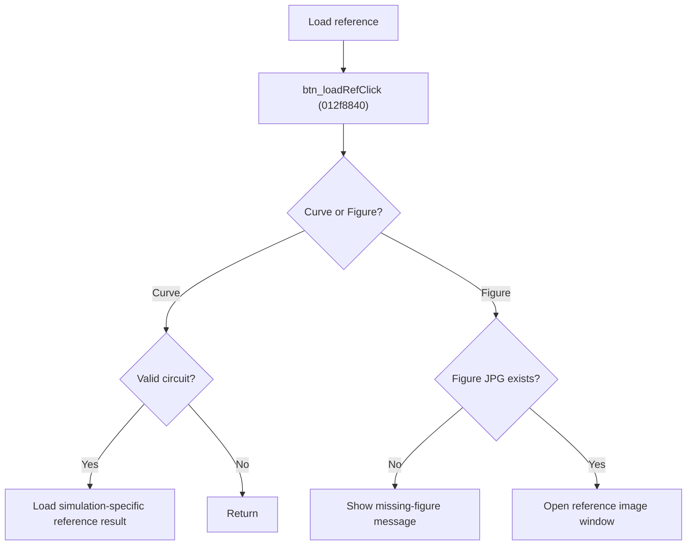

# Load Reference

> Analysis status: Source reviewed for `TIARA-diz.6.7.1969`.

## Control

| Property | Recovered value |
| --- | --- |
| Form | frmModelTestBenchEditor |
| Component path | frmModelTestBenchEditor.pnlMain.pnlTestOptions.grB_references.btn_loadRef |
| Control class | TButton |
| Caption | Load |
| Hint | See Resource evidence below. |
| Handler name | btn_loadRefClick |
| Handler address | 012f8840 |
| Graph node | `resource:dfm:frmModelTestBenchEditor/frmModelTestBenchEditor.pnlMain.pnlTestOptions.grB_references.btn_loadRef` |
| Handler node | `function:012f8840` |
| Graph layer | UI |

## What happens when clicked

- Branches on the sibling reference-type radio buttons.
- For Curve, a valid current circuit builds the simulation-specific `.refresult.tr`, `.refresult.dc`, or `.refresult.ac` path, with `.corner` when enabled, and loads it into the result view.
- For Figure, builds `<circuit> Figure.jpg` under the circuit folder. It shows `Figure does not exist.` when the file is absent; otherwise it opens an image window titled for the circuit.
- If neither branch is selected, or Curve has no valid circuit item, the handler returns without a message.

## Click flow

## Handler evidence

- Source: [FUN_012f8840](../../../DecompiledSources/Tina16/functions/00000000012F8840__FUN_012f8840.c)
- Recovered role: Load the selected circuit's reference curve or reference figure.
- The References group contains Curve and Figure radio buttons next to this Load button.
- FUN_012f8840 reads those two radio states and calls FUN_01301c40 with reference mode for Curve.
- The Figure branch verifies the JPG path before it creates and shows the image form.
- Relevant callee: [FUN_01301c40](../../../DecompiledSources/Tina16/functions/0000000001301C40__FUN_01301c40.c)

## Resource evidence

- Caption: `Load`.
- No extracted glyph is present for this control.
- Nearby labels, when cited above, are candidates from the same parent and are used only with handler evidence.

## Analysis limits

- No runtime UI test was performed.
- The explanation does not infer behavior from the caption, hint, or nearby labels alone.
