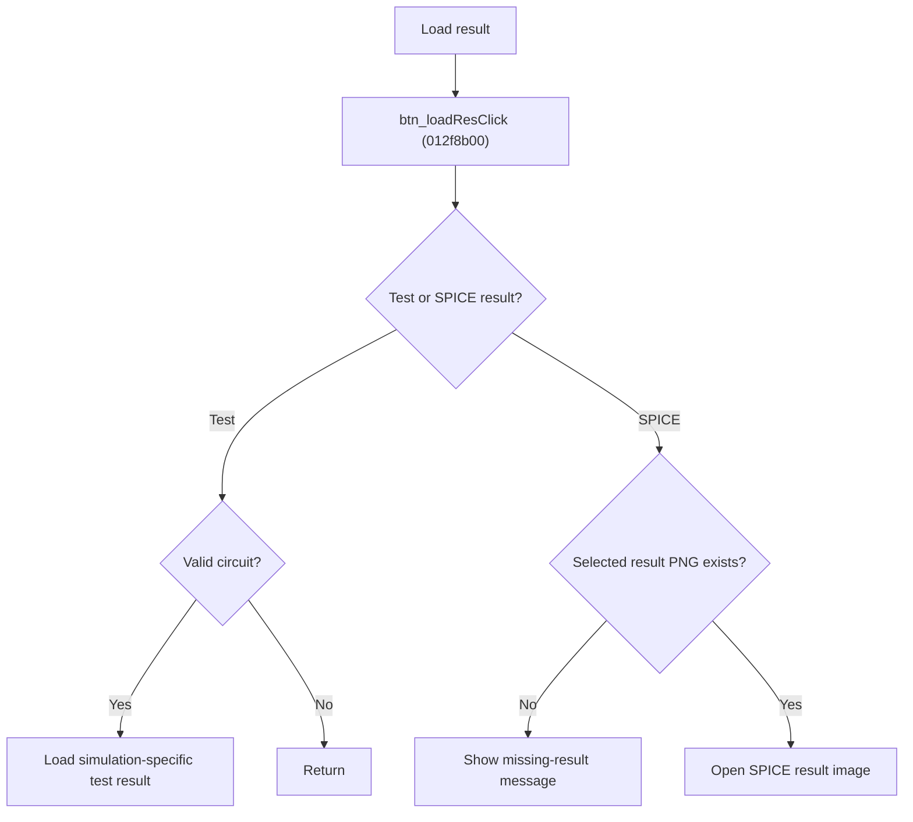

# Load Test or SPICE Result

> Analysis status: Source reviewed for `TIARA-diz.6.7.1970`.

## Control

| Property | Recovered value |
| --- | --- |
| Form | frmModelTestBenchEditor |
| Component path | frmModelTestBenchEditor.pnlMain.pnlTestOptions.grB_results.btn_loadRes |
| Control class | TButton |
| Caption | Load |
| Hint | See Resource evidence below. |
| Handler name | btn_loadResClick |
| Handler address | 012f8b00 |
| Graph node | `resource:dfm:frmModelTestBenchEditor/frmModelTestBenchEditor.pnlMain.pnlTestOptions.grB_results.btn_loadRes` |
| Handler node | `function:012f8b00` |
| Graph layer | UI |

## What happens when clicked

- Branches on the Test result, LTspice result, PSpice result, and SIMetrix result radio buttons.
- For Test result, a valid current circuit loads the simulation-specific `.testresult.tr`, `.testresult.dc`, or `.testresult.ac` file, with `.corner` when enabled.
- For a SPICE result, builds a PNG path with the selected simulator suffix. It shows `Spice result does not exist.` when the file is absent; otherwise it opens an image window titled for the circuit.
- If no result type is selected, or Test result has no valid circuit item, the handler returns without a message.

## Click flow

## Handler evidence

- Source: [FUN_012f8b00](../../../DecompiledSources/Tina16/functions/00000000012F8B00__FUN_012f8b00.c)
- Recovered role: Load the selected circuit's test result or SPICE result image.
- The Results group contains the four recovered radio controls next to this Load button.
- FUN_012f8b00 reads their distinct checked states and calls FUN_01301c40 with test-result mode for Test result.
- The SPICE branches use `-LTSpice`, `-PSpice`, or ` (SIMetrix format)-graph` before `.png`.
- Relevant callee: [FUN_01301c40](../../../DecompiledSources/Tina16/functions/0000000001301C40__FUN_01301c40.c)

## Resource evidence

- Caption: `Load`.
- No extracted glyph is present for this control.
- Nearby labels, when cited above, are candidates from the same parent and are used only with handler evidence.

## Analysis limits

- No runtime UI test was performed.
- The explanation does not infer behavior from the caption, hint, or nearby labels alone.
