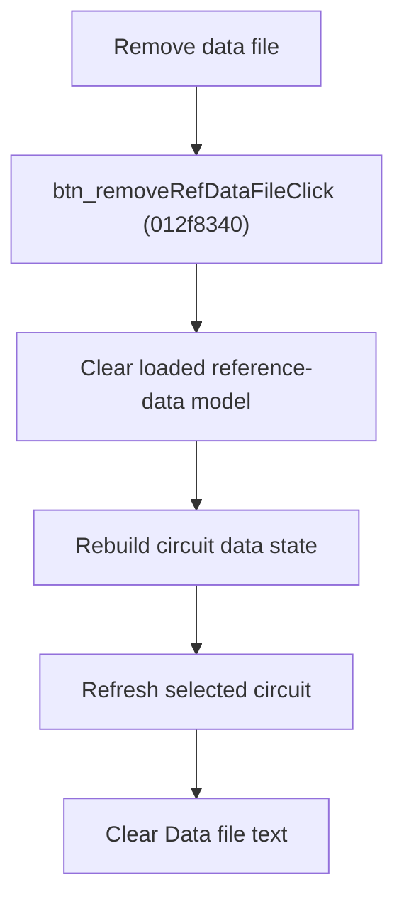

# Remove Reference Data File

> Analysis status: Source reviewed for `TIARA-diz.6.7.1953`.

## Control

| Property | Recovered value |
| --- | --- |
| Form | frmModelTestBenchEditor |
| Component path | frmModelTestBenchEditor.pnlMain.pnlFileSelector.pnlSetRoot.btn_removeRefDataFile |
| Control class | TButton |
| Caption | Remove data file |
| Hint | See Resource evidence below. |
| Handler name | btn_removeRefDataFileClick |
| Handler address | 012f8340 |
| Graph node | `resource:dfm:frmModelTestBenchEditor/frmModelTestBenchEditor.pnlMain.pnlFileSelector.pnlSetRoot.btn_removeRefDataFile` |
| Handler node | `function:012f8340` |
| Graph layer | UI |

## What happens when clicked

- Clears the loaded reference-data model and cached objects.
- Rebuilds per-circuit data state and refreshes the selected circuit controls.
- Clears the Data file edit.
- The handler does not show a confirmation and does not delete a file from disk.

## Click flow

## Handler evidence

- Source: [FUN_012f8340](../../../DecompiledSources/Tina16/functions/00000000012F8340__FUN_012f8340.c)
- Recovered role: Clear the reference-data file association and derived editor state.
- The nearest same-parent label is Data file.
- FUN_012f8340 calls the data-model clear, circuit-state rebuild, cache cleanup, and selected-node refresh routines before clearing edit +0x7D8.
- There is no filesystem delete call in the recovered handler.

## Resource evidence

- Caption: `Remove data file`.
- No extracted glyph is present for this control.
- Nearby labels, when cited above, are candidates from the same parent and are used only with handler evidence.

## Analysis limits

- No runtime UI test was performed.
- The explanation does not infer behavior from the caption, hint, or nearby labels alone.
