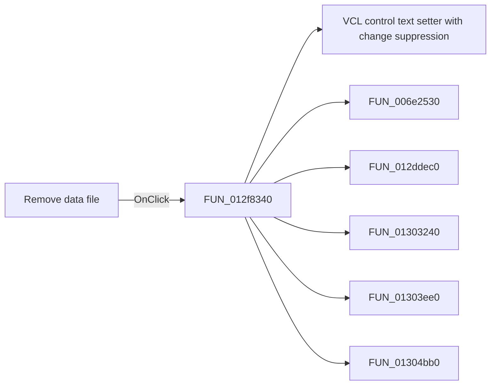

# Remove data file

> Analysis status: Pending individual source review.

## Control

| Property | Recovered value |
| --- | --- |
| Form | frmModelTestBenchEditor |
| Component path | frmModelTestBenchEditor.pnlMain.pnlFileSelector.pnlSetRoot.btn_removeRefDataFile |
| Control class | TButton |
| Caption | Remove data file |
| Hint | Not present in the recovered resource. |
| Text | Not present in the recovered resource. |
| Handler name | btn_removeRefDataFileClick |
| Handler address | 012f8340 |
| Graph node | `resource:dfm:frmModelTestBenchEditor/frmModelTestBenchEditor.pnlMain.pnlFileSelector.pnlSetRoot.btn_removeRefDataFile` |
| Handler node | `function:012f8340` |
| Graph layer | UI |

## What happens when clicked

Pending individual analysis. An agent must read the recovered handler source and its relevant callees before it replaces this text.

## Click flow

## Handler evidence

- Source: [DecompiledSources/Tina16/functions/00000000012F8340__FUN_012f8340.c](../../../DecompiledSources/Tina16/functions/00000000012F8340__FUN_012f8340.c)
- Recovered role: Not present in the recovered resource.
- Current graph summary: Handles 1 Delphi UI event: frmModelTestBenchEditor.pnlMain.pnlFileSelector.pnlSetRoot.btn_removeRefDataFile.OnClick.
- Current graph behavior: Not present in the recovered resource.
- Current graph evidence: Not present in the recovered resource.
- Complexity: complex
- Distinct outgoing calls: 7

## Direct calls

- `function:0064de00` — VCL control text setter with change suppression
- `function:006e2530` — FUN_006e2530
- `function:012ddec0` — FUN_012ddec0
- `function:01303240` — FUN_01303240
- `function:01303ee0` — FUN_01303ee0
- `function:01304bb0` — FUN_01304bb0
- `function:013056e0` — FUN_013056e0

## Resource evidence

- Kind: Not present in the recovered resource.
- Modal result: Not present in the recovered resource.
- Checked state: Not present in the recovered resource.
- List items: Not present in the recovered resource.
- Image reference: Not present in the recovered resource.
- Extracted glyph: None.

## Nearby label candidates

Nearby labels are layout candidates only. They are not proof of behavior.

- Rank 1: Data file at distance 378.
- Rank 2: Result folder at distance 411.
- Rank 3: Circuit folder at distance 470.

## Analysis limits

- Do not infer behavior from the control class, caption, hint, glyph, or nearby label alone.
- Do not replace the pending status until the handler source and relevant call path provide enough evidence.
