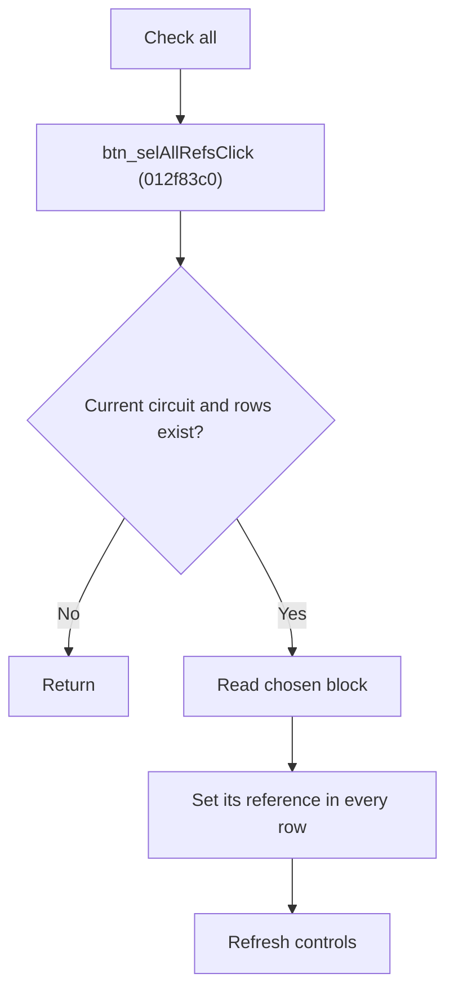

# Check All References

> Analysis status: Source reviewed for `TIARA-diz.6.7.1965`.

## Control

| Property | Recovered value |
| --- | --- |
| Form | frmModelTestBenchEditor |
| Component path | frmModelTestBenchEditor.pnlMain.pnlTestOptions.grB_localSettings.pctrl_localSettingst.ts_select.btn_selAllRefs |
| Control class | TButton |
| Caption | Check all |
| Hint | See Resource evidence below. |
| Handler name | btn_selAllRefsClick |
| Handler address | 012f83c0 |
| Graph node | `resource:dfm:frmModelTestBenchEditor/frmModelTestBenchEditor.pnlMain.pnlTestOptions.grB_localSettings.pctrl_localSettingst.ts_select.btn_selAllRefs` |
| Handler node | `function:012f83c0` |
| Graph layer | UI |

## What happens when clicked

- Reads the block selected by the Choose block control.
- For each local row of the current circuit, sets the reference according to that selected block.
- Returns without changes unless the current item is a circuit, the record list exists, and the local-settings container has rows.
- Refreshes the current circuit controls after the operation.

## Click flow

## Handler evidence

- Source: [FUN_012f83c0](../../../DecompiledSources/Tina16/functions/00000000012F83C0__FUN_012f83c0.c)
- Recovered role: Set all reference selections for the chosen local block.
- The nearby label identifies the controlling combo as Choose block.
- FUN_012f83c0 passes operation 0 and the combo index to FUN_01306a20.
- FUN_01306a20 iterates all local rows and writes the recovered checked value for the chosen reference field.
- Relevant callee: [FUN_01306a20](../../../DecompiledSources/Tina16/functions/0000000001306A20__FUN_01306a20.c)

## Resource evidence

- Caption: `Check all`.
- No extracted glyph is present for this control.
- Nearby labels, when cited above, are candidates from the same parent and are used only with handler evidence.

## Analysis limits

- No runtime UI test was performed.
- The explanation does not infer behavior from the caption, hint, or nearby labels alone.
