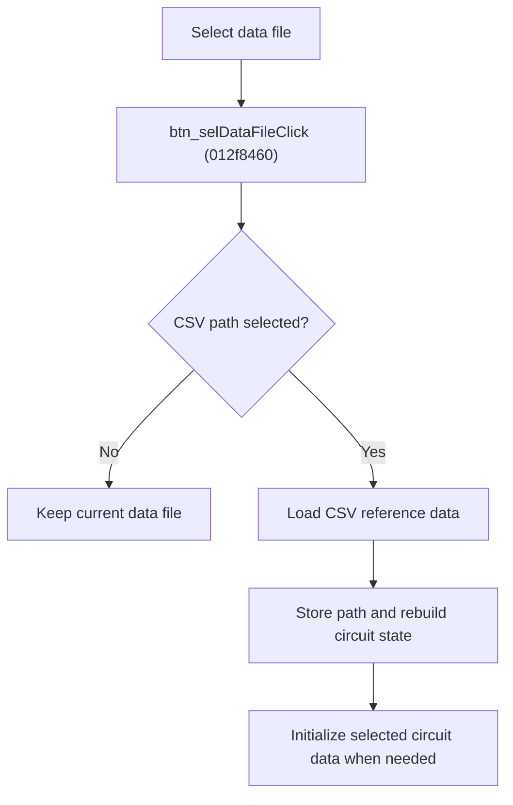

# Select Reference Data File

> Analysis status: Source reviewed for `TIARA-diz.6.7.1954`.

## Control

| Property | Recovered value |
| --- | --- |
| Form | frmModelTestBenchEditor |
| Component path | frmModelTestBenchEditor.pnlMain.pnlFileSelector.pnlSetRoot.btn_selDataFile |
| Control class | TButton |
| Caption | Select data file |
| Hint | See Resource evidence below. |
| Handler name | btn_selDataFileClick |
| Handler address | 012f8460 |
| Graph node | `resource:dfm:frmModelTestBenchEditor/frmModelTestBenchEditor.pnlMain.pnlFileSelector.pnlSetRoot.btn_selDataFile` |
| Handler node | `function:012f8460` |
| Graph layer | UI |

## What happens when clicked

- Opens a file dialog for `Comma-separated values.csv|*.csv`.
- Cancel or an empty path leaves the current association unchanged.
- A selected existing file is loaded into the shared reference-data model. The handler writes the path, rebuilds circuit data state, refreshes the selected circuit, and initializes its data row when required.
- The recovered path has no local error message or rollback block.

## Click flow

## Handler evidence

- Source: [FUN_012f8460](../../../DecompiledSources/Tina16/functions/00000000012F8460__FUN_012f8460.c)
- Recovered role: Load and associate a selected CSV reference-data file.
- The nearest same-parent label is Data file.
- FUN_013020a0 configures the CSV filter, opens the dialog when no path was supplied, verifies existence, and loads the file into the model.
- FUN_012f8460 commits nonempty returned text and refreshes the circuit state.
- Relevant callee: [FUN_013020a0](../../../DecompiledSources/Tina16/functions/00000000013020A0__FUN_013020a0.c)

## Resource evidence

- Caption: `Select data file`.
- No extracted glyph is present for this control.
- Nearby labels, when cited above, are candidates from the same parent and are used only with handler evidence.

## Analysis limits

- No runtime UI test was performed.
- The explanation does not infer behavior from the caption, hint, or nearby labels alone.
