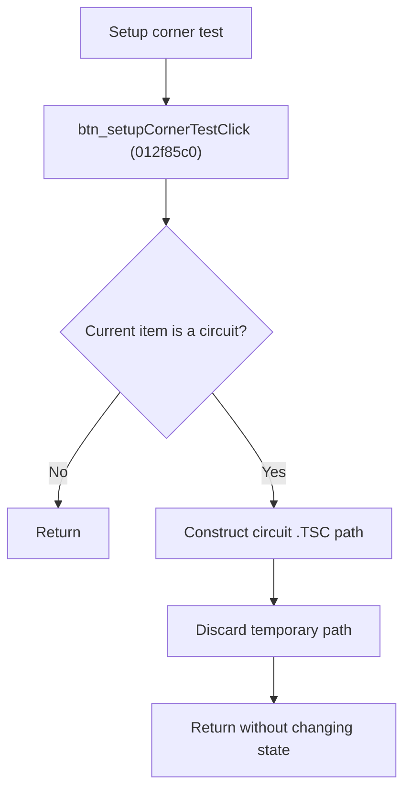

# Setup Corner Test

> Analysis status: Source reviewed for `TIARA-diz.6.7.1972`.

## Control

| Property | Recovered value |
| --- | --- |
| Form | frmModelTestBenchEditor |
| Component path | frmModelTestBenchEditor.pnlMain.pnlTestOptions.grB_testSettings.btn_setupCornerTest |
| Control class | TButton |
| Caption | Setup corner test |
| Hint | See Resource evidence below. |
| Handler name | btn_setupCornerTestClick |
| Handler address | 012f85c0 |
| Graph node | `resource:dfm:frmModelTestBenchEditor/frmModelTestBenchEditor.pnlMain.pnlTestOptions.grB_testSettings.btn_setupCornerTest` |
| Handler node | `function:012f85c0` |
| Graph layer | UI |

## What happens when clicked

- Checks that the current tree item is a circuit.
- Builds a `.TSC` path from the circuit folder and the current item hierarchy.
- Then releases its temporary strings and returns.
- The recovered handler does not open a dialog, read tolerance settings, change state, or use the constructed path. It is a proven no-op after path construction.

## Click flow

## Handler evidence

- Source: [FUN_012f85c0](../../../DecompiledSources/Tina16/functions/00000000012F85C0__FUN_012f85c0.c)
- Recovered role: Construct a corner-test circuit path without applying a recovered action.
- The hint says Tolerance settings, but a hint does not prove implementation.
- FUN_012f85c0 contains path construction and string cleanup only. The constructed local value is not passed to another function or stored on the form.
- The recovered call graph agrees that there is no application callee after the path is built.

## Resource evidence

- Caption: `Setup corner test`.
- No extracted glyph is present for this control.
- Nearby labels, when cited above, are candidates from the same parent and are used only with handler evidence.

## Analysis limits

- No runtime UI test was performed.
- The explanation does not infer behavior from the caption, hint, or nearby labels alone.
