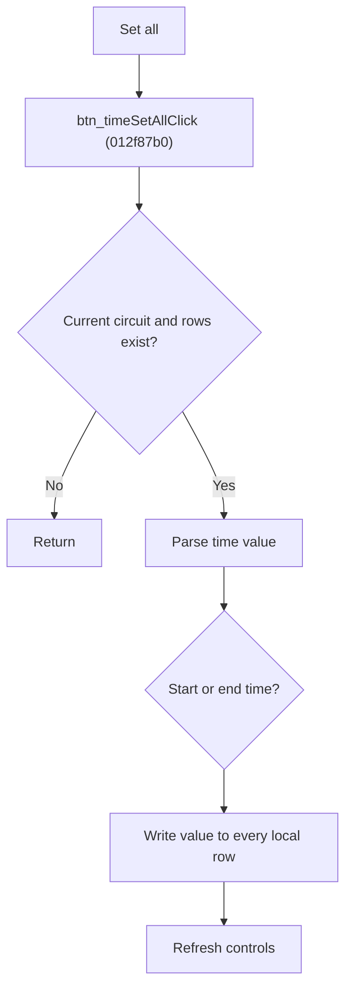

# Set Time for All Local Rows

> Analysis status: Source reviewed for `TIARA-diz.6.7.1966`.

## Control

| Property | Recovered value |
| --- | --- |
| Form | frmModelTestBenchEditor |
| Component path | frmModelTestBenchEditor.pnlMain.pnlTestOptions.grB_localSettings.pctrl_localSettingst.ts_time.btn_timeSetAll |
| Control class | TButton |
| Caption | Set all |
| Hint | See Resource evidence below. |
| Handler name | btn_timeSetAllClick |
| Handler address | 012f87b0 |
| Graph node | `resource:dfm:frmModelTestBenchEditor/frmModelTestBenchEditor.pnlMain.pnlTestOptions.grB_localSettings.pctrl_localSettingst.ts_time.btn_timeSetAll` |
| Handler node | `function:012f87b0` |
| Graph layer | UI |

## What happens when clicked

- Reads the time operation selected by the time-mode control and parses the Set all time edit as a number.
- Applies that number to either the start-time or end-time field of every local row for the current circuit.
- Returns without data changes unless the current item is a circuit and local rows exist.
- Refreshes the current circuit controls. Numeric conversion errors are not caught in this path.

## Click flow

## Handler evidence

- Source: [FUN_012f87b0](../../../DecompiledSources/Tina16/functions/00000000012F87B0__FUN_012f87b0.c)
- Recovered role: Apply one time value to all local comparison rows.
- The same tab contains Select time and seconds labels.
- FUN_012f87b0 reads control +0x9A0 and calls FUN_01306bf0.
- FUN_01306bf0 parses edit +0x9B0 and writes either FUN_012e6050 or FUN_012e60d0 for every row.
- Relevant callee: [FUN_01306bf0](../../../DecompiledSources/Tina16/functions/0000000001306BF0__FUN_01306bf0.c)

## Resource evidence

- Caption: `Set all`.
- No extracted glyph is present for this control.
- Nearby labels, when cited above, are candidates from the same parent and are used only with handler evidence.

## Analysis limits

- No runtime UI test was performed.
- The explanation does not infer behavior from the caption, hint, or nearby labels alone.
