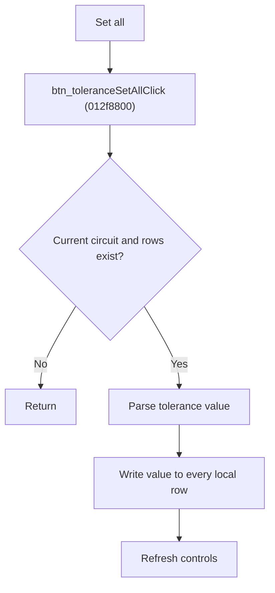

# Set Tolerance for All Local Rows

> Analysis status: Source reviewed for `TIARA-diz.6.7.1967`.

## Control

| Property | Recovered value |
| --- | --- |
| Form | frmModelTestBenchEditor |
| Component path | frmModelTestBenchEditor.pnlMain.pnlTestOptions.grB_localSettings.pctrl_localSettingst.ts_tolerance.btn_toleranceSetAll |
| Control class | TButton |
| Caption | Set all |
| Hint | See Resource evidence below. |
| Handler name | btn_toleranceSetAllClick |
| Handler address | 012f8800 |
| Graph node | `resource:dfm:frmModelTestBenchEditor/frmModelTestBenchEditor.pnlMain.pnlTestOptions.grB_localSettings.pctrl_localSettingst.ts_tolerance.btn_toleranceSetAll` |
| Handler node | `function:012f8800` |
| Graph layer | UI |

## What happens when clicked

- Parses the Set tolerance edit as a number.
- Writes that value to every local tolerance row for the current circuit.
- Returns without data changes unless the current item is a circuit and local rows exist.
- Refreshes the current circuit controls. Numeric conversion errors are not caught in this path.

## Click flow

## Handler evidence

- Source: [FUN_012f8800](../../../DecompiledSources/Tina16/functions/00000000012F8800__FUN_012f8800.c)
- Recovered role: Apply one tolerance percentage to all local comparison rows.
- The same tab contains Set tolerance and percent labels.
- FUN_012f8800 calls FUN_01306de0 then refreshes the current node.
- FUN_01306de0 parses edit +0x9C8 and calls FUN_012e6150 for every local row.
- Relevant callee: [FUN_01306de0](../../../DecompiledSources/Tina16/functions/0000000001306DE0__FUN_01306de0.c)

## Resource evidence

- Caption: `Set all`.
- No extracted glyph is present for this control.
- Nearby labels, when cited above, are candidates from the same parent and are used only with handler evidence.

## Analysis limits

- No runtime UI test was performed.
- The explanation does not infer behavior from the caption, hint, or nearby labels alone.
