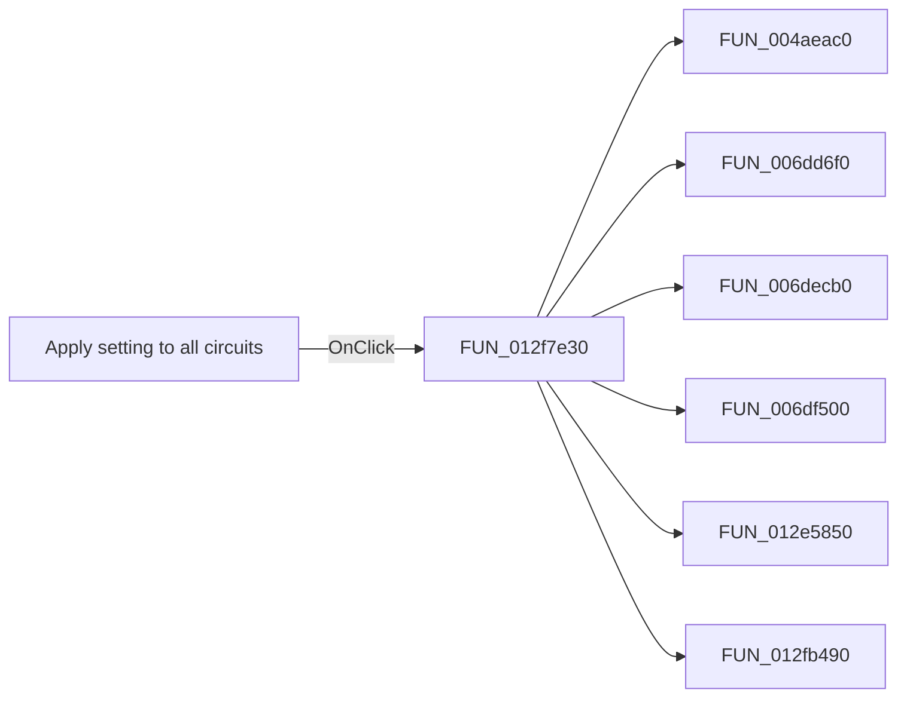

# Apply setting to all circuits

> Analysis status: Pending individual source review.

## Control

| Property | Recovered value |
| --- | --- |
| Form | frmModelTestBenchEditor |
| Component path | frmModelTestBenchEditor.pnlMain.pnlTestOptions.grB_testSettings.btnApplyAll |
| Control class | TButton |
| Caption | Apply setting to all circuits |
| Hint | Apply comparison settings (except reference values) to all circuits. |
| Text | Not present in the recovered resource. |
| Handler name | btnApplyAllClick |
| Handler address | 012f7e30 |
| Graph node | `resource:dfm:frmModelTestBenchEditor/frmModelTestBenchEditor.pnlMain.pnlTestOptions.grB_testSettings.btnApplyAll` |
| Handler node | `function:012f7e30` |
| Graph layer | UI |

## What happens when clicked

Pending individual analysis. An agent must read the recovered handler source and its relevant callees before it replaces this text.

## Click flow

## Handler evidence

- Source: [DecompiledSources/Tina16/functions/00000000012F7E30__FUN_012f7e30.c](../../../DecompiledSources/Tina16/functions/00000000012F7E30__FUN_012f7e30.c)
- Recovered role: Not present in the recovered resource.
- Current graph summary: Handles 1 Delphi UI event: frmModelTestBenchEditor.pnlMain.pnlTestOptions.grB_testSettings.btnApplyAll.OnClick.
- Current graph behavior: Not present in the recovered resource.
- Current graph evidence: Not present in the recovered resource.
- Complexity: complex
- Distinct outgoing calls: 6

## Direct calls

- `function:004aeac0` — FUN_004aeac0
- `function:006dd6f0` — FUN_006dd6f0
- `function:006decb0` — FUN_006decb0
- `function:006df500` — FUN_006df500
- `function:012e5850` — FUN_012e5850
- `function:012fb490` — FUN_012fb490

## Resource evidence

- Kind: Not present in the recovered resource.
- Modal result: Not present in the recovered resource.
- Checked state: Not present in the recovered resource.
- List items: Not present in the recovered resource.
- Image reference: Not present in the recovered resource.
- Extracted glyph: None.

## Nearby label candidates

Nearby labels are layout candidates only. They are not proof of behavior.

- No same-parent label candidate is available.

## Analysis limits

- Do not infer behavior from the control class, caption, hint, glyph, or nearby label alone.
- Do not replace the pending status until the handler source and relevant call path provide enough evidence.
