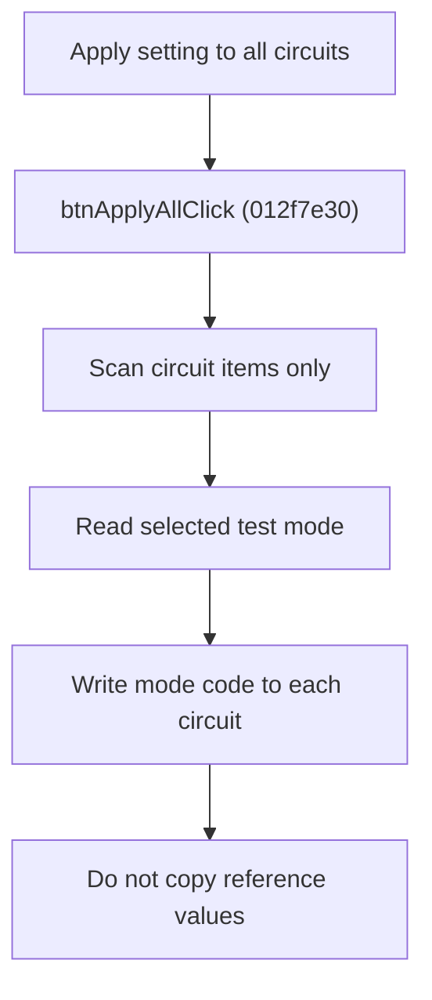

# Apply Test Setting to All Circuits

> Analysis status: Source reviewed for `TIARA-diz.6.7.1971`.

## Control

| Property | Recovered value |
| --- | --- |
| Form | frmModelTestBenchEditor |
| Component path | frmModelTestBenchEditor.pnlMain.pnlTestOptions.grB_testSettings.btnApplyAll |
| Control class | TButton |
| Caption | Apply setting to all circuits |
| Hint | See Resource evidence below. |
| Handler name | btnApplyAllClick |
| Handler address | 012f7e30 |
| Graph node | `resource:dfm:frmModelTestBenchEditor/frmModelTestBenchEditor.pnlMain.pnlTestOptions.grB_testSettings.btnApplyAll` |
| Handler node | `function:012f7e30` |
| Graph layer | UI |

## What happens when clicked

- Scans every tree item and processes only circuit items.
- Stores the current item state before it applies the selected test-mode radio value to that circuit record.
- The recovered mode values are 0 for Do not run, 1 for Save reference, 2 for Comparison, and 3 for Run without comparison.
- Reference values are not copied. This matches the control hint.
- If the tree has no circuit items, the handler returns without an error.

## Click flow

## Handler evidence

- Source: [FUN_012f7e30](../../../DecompiledSources/Tina16/functions/00000000012F7E30__FUN_012f7e30.c)
- Recovered role: Apply the selected test-mode setting to every circuit item.
- The hint says: Apply comparison settings (except reference values) to all circuits.
- FUN_012f7e30 tests item flag 0x20, calls FUN_012fb490, reads the test-mode radio states, and writes one of the four mode codes with FUN_012e5850.
- The recovered decompilation repeats one radio-field read in the last branch, but the distinct radio handlers confirm the four stored codes.

## Resource evidence

- Caption: `Apply setting to all circuits`.
- No extracted glyph is present for this control.
- Nearby labels, when cited above, are candidates from the same parent and are used only with handler evidence.

## Analysis limits

- No runtime UI test was performed.
- The explanation does not infer behavior from the caption, hint, or nearby labels alone.
