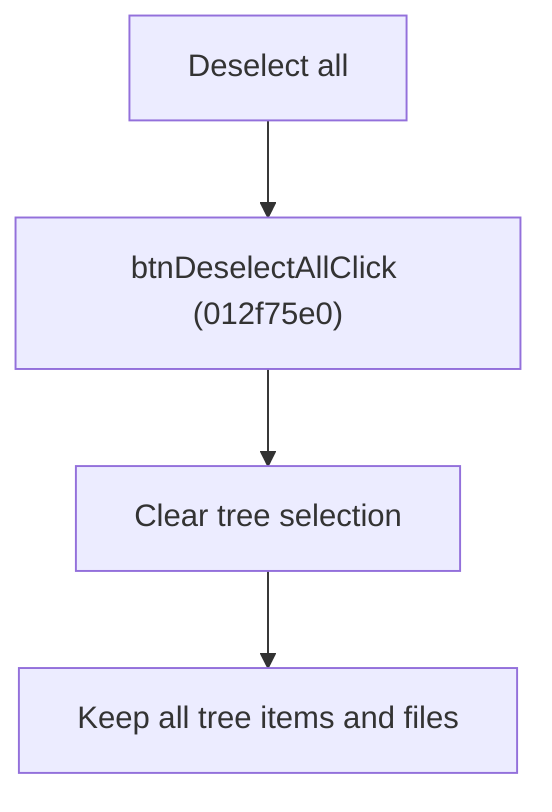

# Deselect All Circuits

> Analysis status: Source reviewed for `TIARA-diz.6.7.1947`.

## Control

| Property | Recovered value |
| --- | --- |
| Form | frmModelTestBenchEditor |
| Component path | frmModelTestBenchEditor.pnlMain.pnlFileSelector.pnlSelectors.btnDeselectAll |
| Control class | TButton |
| Caption | Deselect all |
| Hint | See Resource evidence below. |
| Handler name | btnDeselectAllClick |
| Handler address | 012f75e0 |
| Graph node | `resource:dfm:frmModelTestBenchEditor/frmModelTestBenchEditor.pnlMain.pnlFileSelector.pnlSelectors.btnDeselectAll` |
| Handler node | `function:012f75e0` |
| Graph layer | UI |

## What happens when clicked

- Calls the circuit tree's recovered clear-selection method.
- It does not remove tree items or circuit files.
- It has no empty-tree error branch.

## Click flow

## Handler evidence

- Source: [FUN_012f75e0](../../../DecompiledSources/Tina16/functions/00000000012F75E0__FUN_012f75e0.c)
- Recovered role: Clear the circuit-tree multi-selection.
- FUN_012f75e0 makes one virtual call on the tree at form offset +0x700 with argument 1.
- The neighboring Select all and Invert selection handlers use separate tree multi-selection methods.

## Resource evidence

- Caption: `Deselect all`.
- No extracted glyph is present for this control.
- Nearby labels, when cited above, are candidates from the same parent and are used only with handler evidence.

## Analysis limits

- No runtime UI test was performed.
- The explanation does not infer behavior from the caption, hint, or nearby labels alone.
