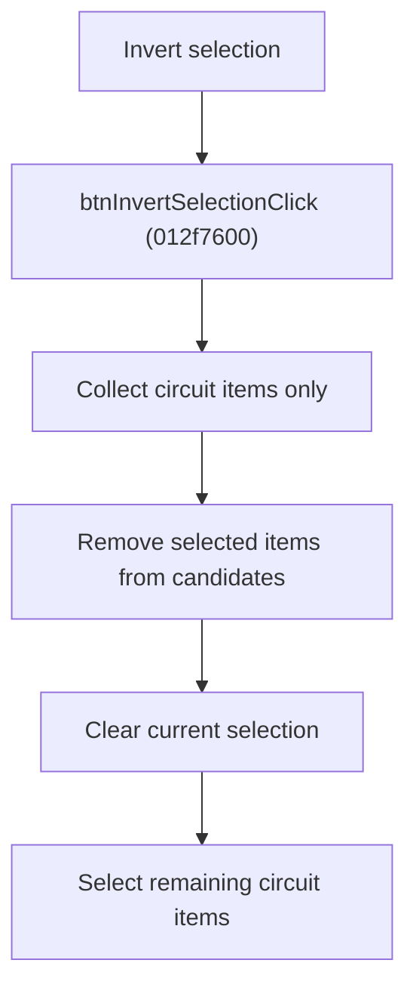

# Invert Circuit Selection

> Analysis status: Source reviewed for `TIARA-diz.6.7.1948`.

## Control

| Property | Recovered value |
| --- | --- |
| Form | frmModelTestBenchEditor |
| Component path | frmModelTestBenchEditor.pnlMain.pnlFileSelector.pnlSelectors.btnInvertSelection |
| Control class | TButton |
| Caption | Invert selection |
| Hint | See Resource evidence below. |
| Handler name | btnInvertSelectionClick |
| Handler address | 012f7600 |
| Graph node | `resource:dfm:frmModelTestBenchEditor/frmModelTestBenchEditor.pnlMain.pnlFileSelector.pnlSelectors.btnInvertSelection` |
| Handler node | `function:012f7600` |
| Graph layer | UI |

## What happens when clicked

- Builds a list of all tree items whose recovered item flag marks a circuit.
- Removes each currently selected item from that list.
- Clears the current selection, then selects the remaining circuit items. Folder and root items are not added.
- An empty tree or a tree with no circuit items results in an empty selection.

## Click flow

## Handler evidence

- Source: [FUN_012f7600](../../../DecompiledSources/Tina16/functions/00000000012F7600__FUN_012f7600.c)
- Recovered role: Invert the selection of circuit items in the testbench tree.
- FUN_012f7600 tests item-data flag 0x20 before it adds an item to the candidate list.
- It removes every item returned by the tree's selected-item accessor, then applies the remaining list through the multi-select method.

## Resource evidence

- Caption: `Invert selection`.
- No extracted glyph is present for this control.
- Nearby labels, when cited above, are candidates from the same parent and are used only with handler evidence.

## Analysis limits

- No runtime UI test was performed.
- The explanation does not infer behavior from the caption, hint, or nearby labels alone.
