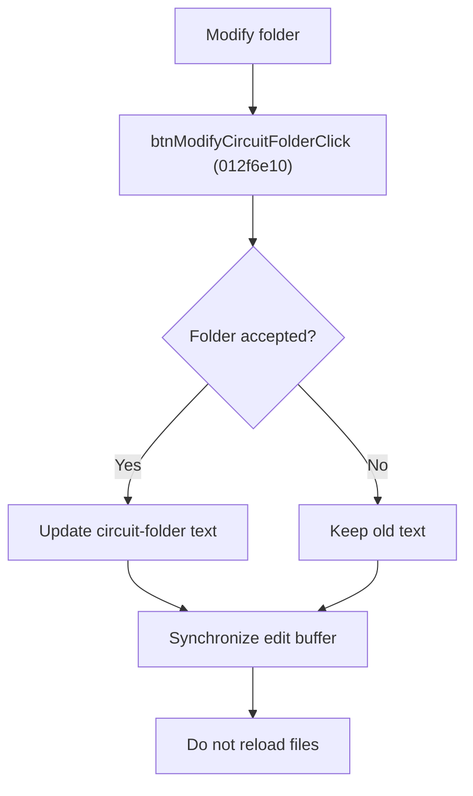

# Modify Circuit Folder

> Analysis status: Source reviewed for `TIARA-diz.6.7.1950`.

## Control

| Property | Recovered value |
| --- | --- |
| Form | frmModelTestBenchEditor |
| Component path | frmModelTestBenchEditor.pnlMain.pnlFileSelector.pnlSetRoot.btnModifyCircuitFolder |
| Control class | TButton |
| Caption | Modify folder |
| Hint | See Resource evidence below. |
| Handler name | btnModifyCircuitFolderClick |
| Handler address | 012f6e10 |
| Graph node | `resource:dfm:frmModelTestBenchEditor/frmModelTestBenchEditor.pnlMain.pnlFileSelector.pnlSetRoot.btnModifyCircuitFolder` |
| Handler node | `function:012f6e10` |
| Graph layer | UI |

## What happens when clicked

- Opens the recovered folder/text dialog with the current Circuit folder value.
- After acceptance, writes the selected folder to the Circuit folder edit. Cancel keeps the old value.
- After either result, synchronizes the edit controls' internal text buffers. It does not reload the circuit tree.
- Use Reload files separately to reconcile the tree with the new folder.

## Click flow

## Handler evidence

- Source: [FUN_012f6e10](../../../DecompiledSources/Tina16/functions/00000000012F6E10__FUN_012f6e10.c)
- Recovered role: Replace the circuit-folder text after folder selection.
- The nearest same-parent label is Circuit folder.
- FUN_012f6e10 writes edit +0x7A0 only when FUN_00b96980 reports acceptance, then always calls FUN_01303df0.
- FUN_01303df0 only copies current edit text to internal control buffers; it does not enumerate files.
- Relevant callee: [FUN_01303df0](../../../DecompiledSources/Tina16/functions/0000000001303DF0__FUN_01303df0.c)

## Resource evidence

- Caption: `Modify folder`.
- No extracted glyph is present for this control.
- Nearby labels, when cited above, are candidates from the same parent and are used only with handler evidence.

## Analysis limits

- No runtime UI test was performed.
- The explanation does not infer behavior from the caption, hint, or nearby labels alone.
