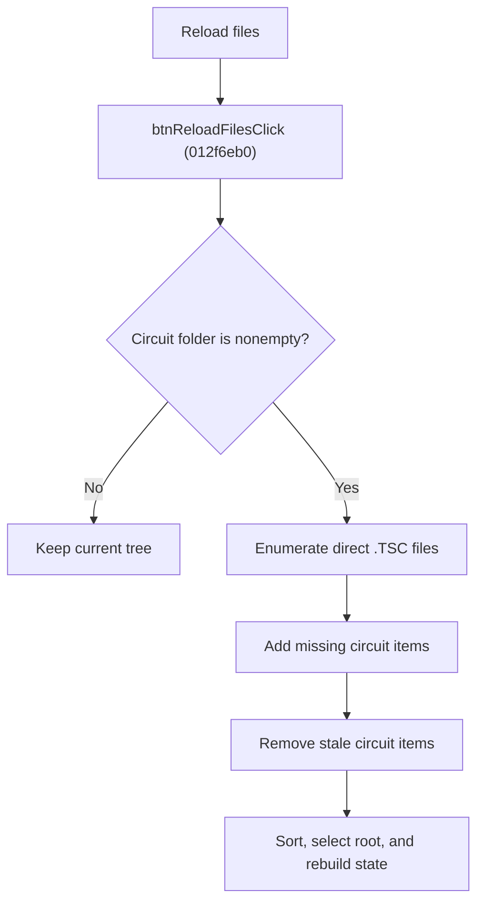

# Reload Circuit Files

> Analysis status: Source reviewed for `TIARA-diz.6.7.1951`.

## Control

| Property | Recovered value |
| --- | --- |
| Form | frmModelTestBenchEditor |
| Component path | frmModelTestBenchEditor.pnlMain.pnlFileSelector.pnlSetRoot.btnReloadFiles |
| Control class | TButton |
| Caption | Reload files |
| Hint | See Resource evidence below. |
| Handler name | btnReloadFilesClick |
| Handler address | 012f6eb0 |
| Graph node | `resource:dfm:frmModelTestBenchEditor/frmModelTestBenchEditor.pnlMain.pnlFileSelector.pnlSetRoot.btnReloadFiles` |
| Handler node | `function:012f6eb0` |
| Graph layer | UI |

## What happens when clicked

- If the Circuit folder text is empty, returns without changing the tree.
- Enumerates the folder's direct `*.*` entries and keeps files with a case-insensitive `.TSC` extension.
- Adds missing circuit items and removes circuit items whose filenames are no longer present. It does not delete disk files.
- Sorts the tree, selects its root, and rebuilds per-circuit state. The recovered handler does not recurse into subfolders.

## Click flow

## Handler evidence

- Source: [FUN_012f6eb0](../../../DecompiledSources/Tina16/functions/00000000012F6EB0__FUN_012f6eb0.c)
- Recovered role: Reconcile circuit-tree items with .TSC files in the circuit folder.
- The nearest same-parent label is Circuit folder.
- FUN_012f6eb0 searches circuit-folder\\*.*, compares `.TSC` names with existing flag-0x20 tree items, and applies additions and removals.
- The final calls sort/select the tree and call FUN_01303240 with mode 3.

## Resource evidence

- Caption: `Reload files`.
- No extracted glyph is present for this control.
- Nearby labels, when cited above, are candidates from the same parent and are used only with handler evidence.

## Analysis limits

- No runtime UI test was performed.
- The explanation does not infer behavior from the caption, hint, or nearby labels alone.
