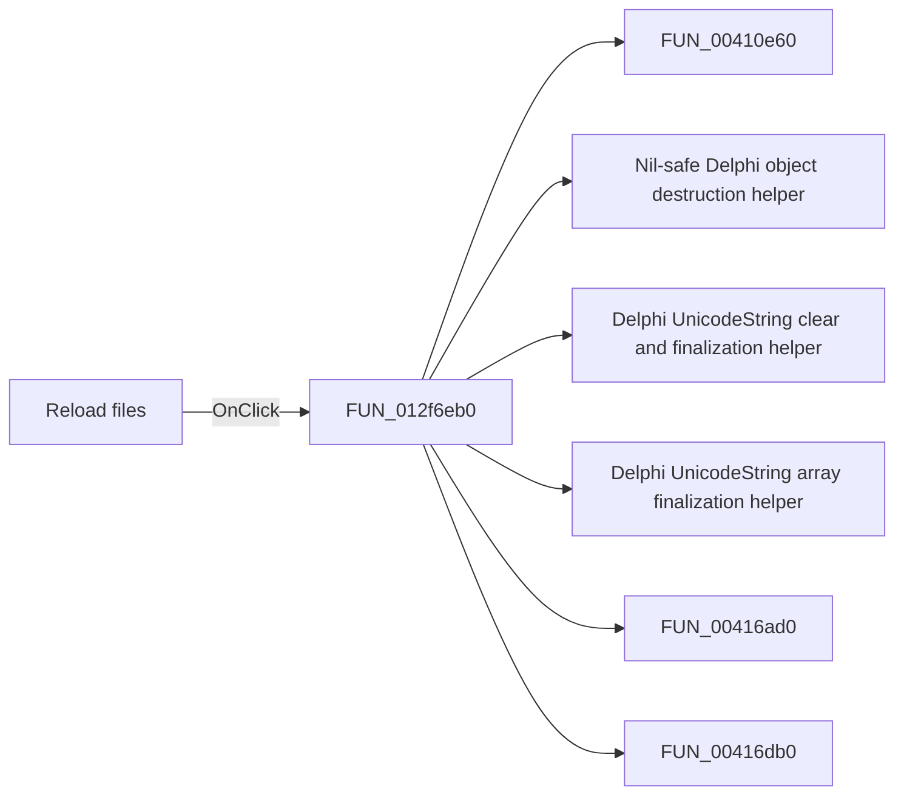

# Reload files

> Analysis status: Pending individual source review.

## Control

| Property | Recovered value |
| --- | --- |
| Form | frmModelTestBenchEditor |
| Component path | frmModelTestBenchEditor.pnlMain.pnlFileSelector.pnlSetRoot.btnReloadFiles |
| Control class | TButton |
| Caption | Reload files |
| Hint | Not present in the recovered resource. |
| Text | Not present in the recovered resource. |
| Handler name | btnReloadFilesClick |
| Handler address | 012f6eb0 |
| Graph node | `resource:dfm:frmModelTestBenchEditor/frmModelTestBenchEditor.pnlMain.pnlFileSelector.pnlSetRoot.btnReloadFiles` |
| Handler node | `function:012f6eb0` |
| Graph layer | UI |

## What happens when clicked

Pending individual analysis. An agent must read the recovered handler source and its relevant callees before it replaces this text.

## Click flow

## Handler evidence

- Source: [DecompiledSources/Tina16/functions/00000000012F6EB0__FUN_012f6eb0.c](../../../DecompiledSources/Tina16/functions/00000000012F6EB0__FUN_012f6eb0.c)
- Recovered role: Not present in the recovered resource.
- Current graph summary: Handles 1 Delphi UI event: frmModelTestBenchEditor.pnlMain.pnlFileSelector.pnlSetRoot.btnReloadFiles.OnClick.
- Current graph behavior: Not present in the recovered resource.
- Current graph evidence: Not present in the recovered resource.
- Complexity: complex
- Distinct outgoing calls: 29

## Direct calls

- `function:00410e60` — FUN_00410e60
- `function:00410f20` — Nil-safe Delphi object destruction helper
- `function:00414480` — Delphi UnicodeString clear and finalization helper
- `function:00414560` — Delphi UnicodeString array finalization helper
- `function:00416ad0` — FUN_00416ad0
- `function:00416db0` — FUN_00416db0
- `function:00417580` — FUN_00417580
- `function:00417740` — FUN_00417740
- `function:0043e420` — FUN_0043e420
- `function:00441230` — FUN_00441230
- `function:00441290` — FUN_00441290
- `function:004412c0` — FUN_004412c0
- `function:004414c0` — FUN_004414c0
- `function:00441a10` — FUN_00441a10
- `function:004ae7e0` — FUN_004ae7e0
- `function:004aeac0` — FUN_004aeac0
- `function:0064dd90` — VCL control Unicode text reader
- `function:006decb0` — FUN_006decb0
- `function:006ded10` — FUN_006ded10
- `function:006dee70` — FUN_006dee70
- `function:006df4b0` — FUN_006df4b0
- `function:006df500` — FUN_006df500
- `function:006df690` — FUN_006df690
- `function:006df710` — FUN_006df710
- `function:006e1e60` — FUN_006e1e60
- `function:006e23c0` — FUN_006e23c0
- `function:006e24b0` — FUN_006e24b0
- `function:012f2410` — FUN_012f2410
- `function:01303240` — FUN_01303240

## Resource evidence

- Kind: Not present in the recovered resource.
- Modal result: Not present in the recovered resource.
- Checked state: Not present in the recovered resource.
- List items: Not present in the recovered resource.
- Image reference: Not present in the recovered resource.
- Extracted glyph: None.

## Nearby label candidates

Nearby labels are layout candidates only. They are not proof of behavior.

- Rank 1: Circuit folder at distance 379.
- Rank 2: Result folder at distance 396.
- Rank 3: Data file at distance 429.

## Analysis limits

- Do not infer behavior from the control class, caption, hint, glyph, or nearby label alone.
- Do not replace the pending status until the handler source and relevant call path provide enough evidence.
