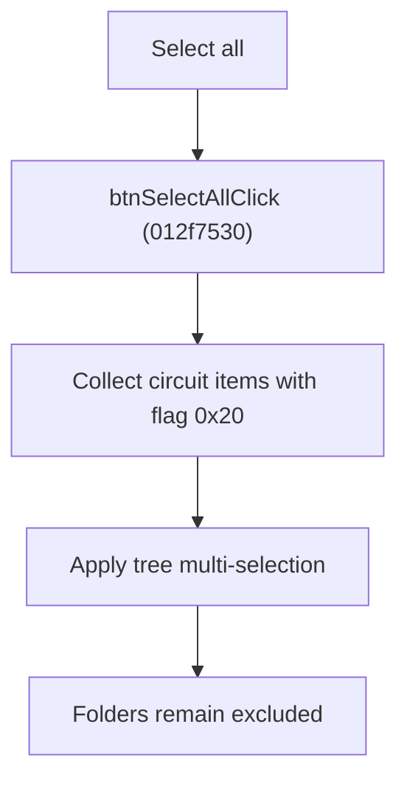

# Select All Circuits

> Analysis status: Source reviewed for `TIARA-diz.6.7.1949`.

## Control

| Property | Recovered value |
| --- | --- |
| Form | frmModelTestBenchEditor |
| Component path | frmModelTestBenchEditor.pnlMain.pnlFileSelector.pnlSelectors.btnSelectAll |
| Control class | TButton |
| Caption | Select all |
| Hint | See Resource evidence below. |
| Handler name | btnSelectAllClick |
| Handler address | 012f7530 |
| Graph node | `resource:dfm:frmModelTestBenchEditor/frmModelTestBenchEditor.pnlMain.pnlFileSelector.pnlSelectors.btnSelectAll` |
| Handler node | `function:012f7530` |
| Graph layer | UI |

## What happens when clicked

- Scans all tree items and collects only items whose recovered item flag marks a circuit.
- Applies that list as the tree multi-selection. Folder and root items are excluded.
- An empty tree results in an empty selection without an error.

## Click flow

## Handler evidence

- Source: [FUN_012f7530](../../../DecompiledSources/Tina16/functions/00000000012F7530__FUN_012f7530.c)
- Recovered role: Select all circuit items in the testbench tree.
- FUN_012f7530 tests item-data flag 0x20 for every tree item.
- It passes the collected list to the tree's recovered multi-selection method.

## Resource evidence

- Caption: `Select all`.
- No extracted glyph is present for this control.
- Nearby labels, when cited above, are candidates from the same parent and are used only with handler evidence.

## Analysis limits

- No runtime UI test was performed.
- The explanation does not infer behavior from the caption, hint, or nearby labels alone.
