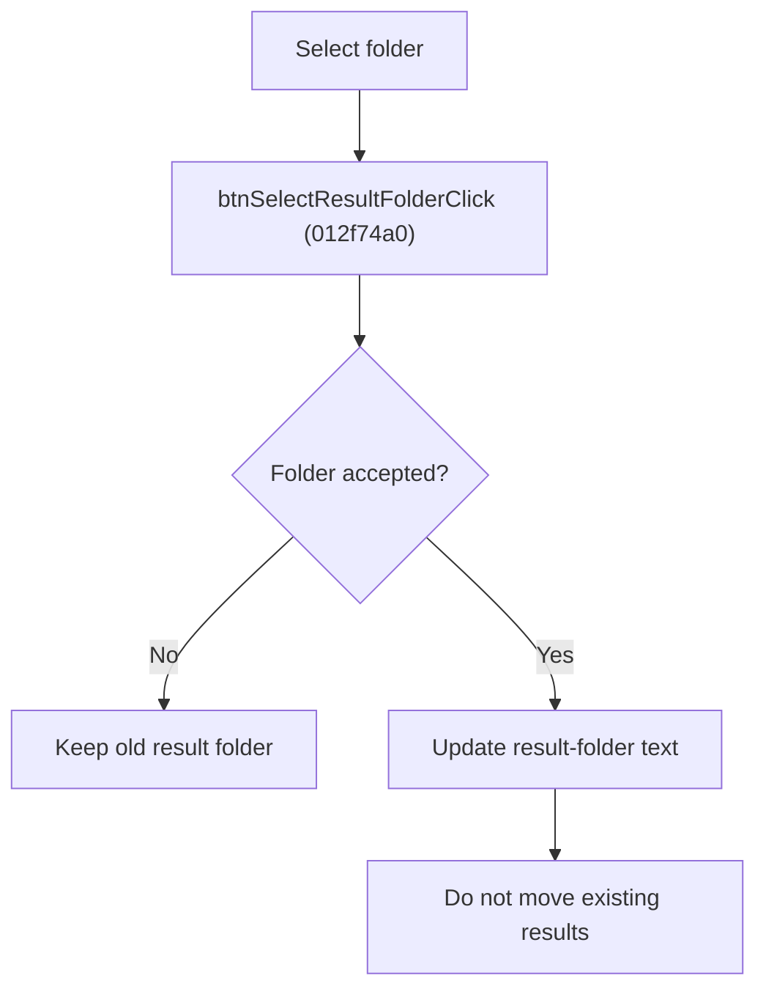

# Select Result Folder

> Analysis status: Source reviewed for `TIARA-diz.6.7.1952`.

## Control

| Property | Recovered value |
| --- | --- |
| Form | frmModelTestBenchEditor |
| Component path | frmModelTestBenchEditor.pnlMain.pnlFileSelector.pnlSetRoot.btnSelectResultFolder |
| Control class | TButton |
| Caption | Select folder |
| Hint | See Resource evidence below. |
| Handler name | btnSelectResultFolderClick |
| Handler address | 012f74a0 |
| Graph node | `resource:dfm:frmModelTestBenchEditor/frmModelTestBenchEditor.pnlMain.pnlFileSelector.pnlSetRoot.btnSelectResultFolder` |
| Handler node | `function:012f74a0` |
| Graph layer | UI |

## What happens when clicked

- Opens the recovered folder/text dialog with the current Result folder value.
- After acceptance, writes the selected folder to the Result folder edit.
- Cancel keeps the old value. The handler does not create the folder or move existing results.

## Click flow

## Handler evidence

- Source: [FUN_012f74a0](../../../DecompiledSources/Tina16/functions/00000000012F74A0__FUN_012f74a0.c)
- Recovered role: Replace the model-test result folder after selection.
- The nearest same-parent label is Result folder.
- FUN_012f74a0 reads edit +0x7C0, calls FUN_00b96980, and writes the returned text only on acceptance.

## Resource evidence

- Caption: `Select folder`.
- No extracted glyph is present for this control.
- Nearby labels, when cited above, are candidates from the same parent and are used only with handler evidence.

## Analysis limits

- No runtime UI test was performed.
- The explanation does not infer behavior from the caption, hint, or nearby labels alone.
