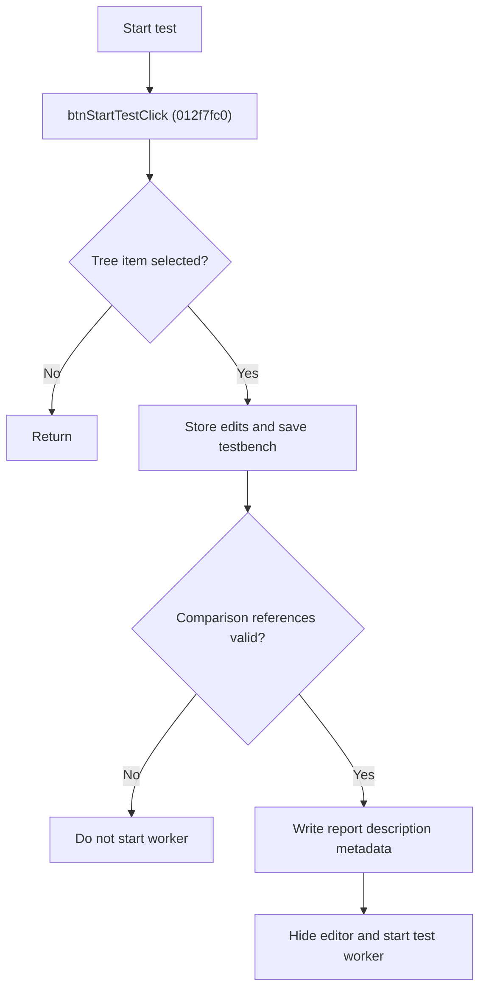

# Start Model Test

> Analysis status: Source reviewed for `TIARA-diz.6.7.1955`.

## Control

| Property | Recovered value |
| --- | --- |
| Form | frmModelTestBenchEditor |
| Component path | frmModelTestBenchEditor.pnlMain.pnlTestOptions.btnStartTest |
| Control class | TButton |
| Caption | Start test |
| Hint | See Resource evidence below. |
| Handler name | btnStartTestClick |
| Handler address | 012f7fc0 |
| Graph node | `resource:dfm:frmModelTestBenchEditor/frmModelTestBenchEditor.pnlMain.pnlTestOptions.btnStartTest` |
| Handler node | `function:012f7fc0` |
| Graph layer | UI |

## What happens when clicked

- Returns without action when the circuit tree has no selected item.
- Stores current circuit edits, then calls the normal Save path. For a Noname testbench, that path can open the save dialog.
- Validates required reference curves for circuits in Comparison mode. If validation fails or is canceled, it does not start the worker.
- After validation, writes report description metadata when the circuit folder exists, hides the editor, and starts a model-test worker with the saved testbench path.
- The recovered handler does not receive a success value from Save. A canceled first-time save is therefore not an explicit stop condition in this handler.

## Click flow

## Handler evidence

- Source: [FUN_012f7fc0](../../../DecompiledSources/Tina16/functions/00000000012F7FC0__FUN_012f7fc0.c)
- Recovered role: Validate, save, and start the configured model test.
- The nearby form label says CTRL+ALT+END aborts all simulation processes; it is a UI instruction, not handler logic.
- FUN_012f7fc0 checks selected count, calls FUN_013056e0, FUN_012fc960(mode 0), and tests FUN_01303bc0.
- The accepted validation path calls FUN_01302300, hides the editor, and calls FUN_012f3470, which creates and starts the worker.
- Relevant callee: [FUN_01303bc0](../../../DecompiledSources/Tina16/functions/0000000001303BC0__FUN_01303bc0.c)
- Relevant callee: [FUN_01302300](../../../DecompiledSources/Tina16/functions/0000000001302300__FUN_01302300.c)
- Relevant callee: [FUN_012f3470](../../../DecompiledSources/Tina16/functions/00000000012F3470__FUN_012f3470.c)

## Resource evidence

- Caption: `Start test`.
- No extracted glyph is present for this control.
- Nearby labels, when cited above, are candidates from the same parent and are used only with handler evidence.

## Analysis limits

- No runtime UI test was performed.
- The explanation does not infer behavior from the caption, hint, or nearby labels alone.
