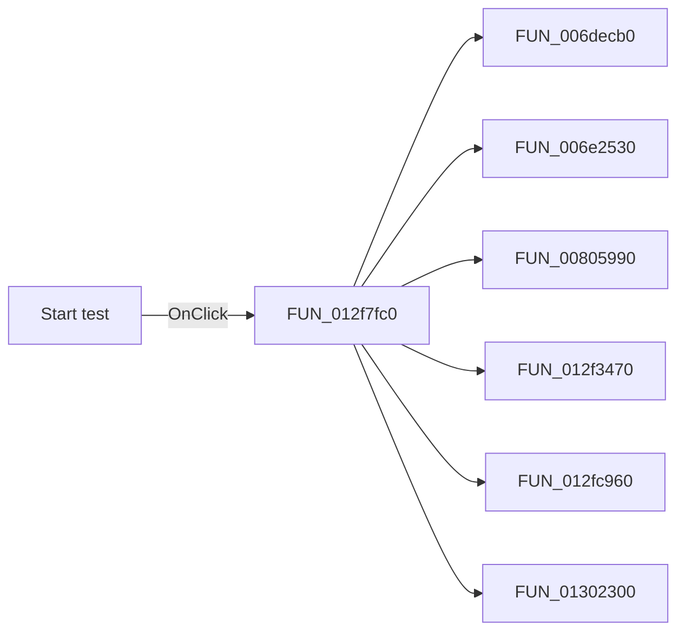

# Start test

> Analysis status: Pending individual source review.

## Control

| Property | Recovered value |
| --- | --- |
| Form | frmModelTestBenchEditor |
| Component path | frmModelTestBenchEditor.pnlMain.pnlTestOptions.btnStartTest |
| Control class | TButton |
| Caption | Start test |
| Hint | Not present in the recovered resource. |
| Text | Not present in the recovered resource. |
| Handler name | btnStartTestClick |
| Handler address | 012f7fc0 |
| Graph node | `resource:dfm:frmModelTestBenchEditor/frmModelTestBenchEditor.pnlMain.pnlTestOptions.btnStartTest` |
| Handler node | `function:012f7fc0` |
| Graph layer | UI |

## What happens when clicked

Pending individual analysis. An agent must read the recovered handler source and its relevant callees before it replaces this text.

## Click flow

## Handler evidence

- Source: [DecompiledSources/Tina16/functions/00000000012F7FC0__FUN_012f7fc0.c](../../../DecompiledSources/Tina16/functions/00000000012F7FC0__FUN_012f7fc0.c)
- Recovered role: Not present in the recovered resource.
- Current graph summary: Handles 1 Delphi UI event: frmModelTestBenchEditor.pnlMain.pnlTestOptions.btnStartTest.OnClick.
- Current graph behavior: Not present in the recovered resource.
- Current graph evidence: Not present in the recovered resource.
- Complexity: complex
- Distinct outgoing calls: 8

## Direct calls

- `function:006decb0` — FUN_006decb0
- `function:006e2530` — FUN_006e2530
- `function:00805990` — FUN_00805990
- `function:012f3470` — FUN_012f3470
- `function:012fc960` — FUN_012fc960
- `function:01302300` — FUN_01302300
- `function:01303bc0` — FUN_01303bc0
- `function:013056e0` — FUN_013056e0

## Resource evidence

- Kind: Not present in the recovered resource.
- Modal result: 1
- Checked state: Not present in the recovered resource.
- List items: Not present in the recovered resource.
- Image reference: Not present in the recovered resource.
- Extracted glyph: None.

## Nearby label candidates

Nearby labels are layout candidates only. They are not proof of behavior.

- Rank 1: (To abort all simulation processes press CTRL+ALT+END.) at distance 197.
- Rank 2: Test mode at distance 274.
- Rank 3: Manufacturer: at distance 741.

## Analysis limits

- Do not infer behavior from the control class, caption, hint, glyph, or nearby label alone.
- Do not replace the pending status until the handler source and relevant call path provide enough evidence.
