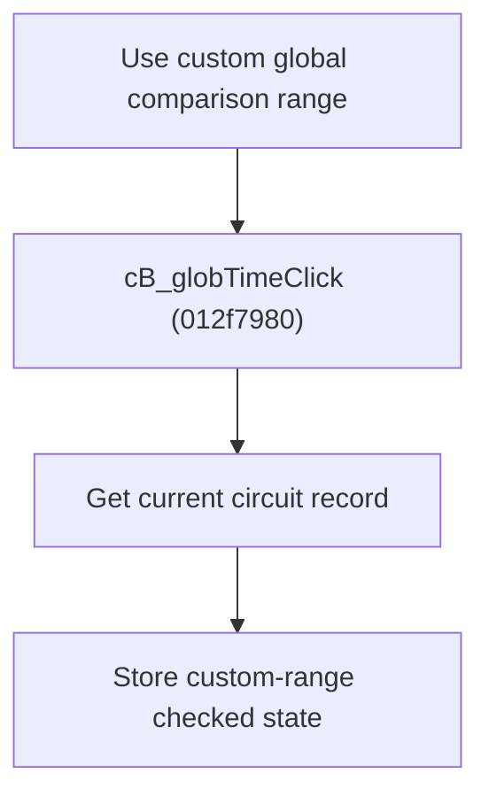

# Use Custom Global Comparison Range

> Analysis status: Source reviewed for `TIARA-diz.6.7.1961`.

## Control

| Property | Recovered value |
| --- | --- |
| Form | frmModelTestBenchEditor |
| Component path | frmModelTestBenchEditor.pnlMain.pnlTestOptions.grB_globalSettings.cB_globTime |
| Control class | TCheckBox |
| Caption | Use custom global comparison range |
| Hint | See Resource evidence below. |
| Handler name | cB_globTimeClick |
| Handler address | 012f7980 |
| Graph node | `resource:dfm:frmModelTestBenchEditor/frmModelTestBenchEditor.pnlMain.pnlTestOptions.grB_globalSettings.cB_globTime` |
| Handler node | `function:012f7980` |
| Graph layer | UI |

## What happens when clicked

- Finds the per-circuit record for the current tree item.
- Writes the check box state to the record's custom global comparison-range field.
- The handler does not copy the Start time or End time texts. Their change handlers manage those values.
- The handler has no null or root-item guard.

## Click flow

## Handler evidence

- Source: [FUN_012f7980](../../../DecompiledSources/Tina16/functions/00000000012F7980__FUN_012f7980.c)
- Recovered role: Store the selected circuit's custom global comparison-range option.
- Nearby labels identify Start time and End time, but proximity alone does not define the field.
- FUN_012f7980 maps the current node index to the record list and passes check box +0x8A0 state to FUN_012e5790.

## Resource evidence

- Caption: `Use custom global comparison range`.
- No extracted glyph is present for this control.
- Nearby labels, when cited above, are candidates from the same parent and are used only with handler evidence.

## Analysis limits

- No runtime UI test was performed.
- The explanation does not infer behavior from the caption, hint, or nearby labels alone.
