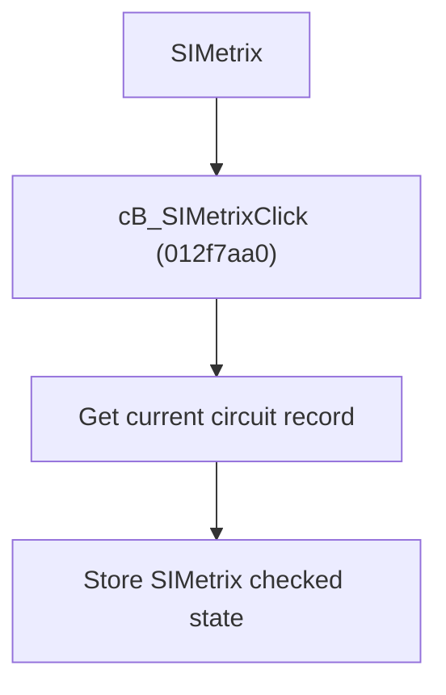

# Include SIMetrix Result

> Analysis status: Source reviewed for `TIARA-diz.6.7.1959`.

## Control

| Property | Recovered value |
| --- | --- |
| Form | frmModelTestBenchEditor |
| Component path | frmModelTestBenchEditor.pnlMain.pnlTestOptions.grB_globalSettings.cB_SIMetrix |
| Control class | TCheckBox |
| Caption | SIMetrix |
| Hint | See Resource evidence below. |
| Handler name | cB_SIMetrixClick |
| Handler address | 012f7aa0 |
| Graph node | `resource:dfm:frmModelTestBenchEditor/frmModelTestBenchEditor.pnlMain.pnlTestOptions.grB_globalSettings.cB_SIMetrix` |
| Handler node | `function:012f7aa0` |
| Graph layer | UI |

## What happens when clicked

- Finds the per-circuit record for the current tree item.
- Writes the SIMetrix checked state to that record.
- The handler has no null or root-item guard. The surrounding UI must keep it available only for a valid circuit.

## Click flow

## Handler evidence

- Source: [FUN_012f7aa0](../../../DecompiledSources/Tina16/functions/00000000012F7AA0__FUN_012f7aa0.c)
- Recovered role: Store the selected circuit's SIMetrix-result option.
- The hint says the option adds a SPICE result as a picture to the report.
- FUN_012f7aa0 maps the current node index to the record list and passes check box +0xA60 state to FUN_012e5810.

## Resource evidence

- Caption: `SIMetrix`.
- No extracted glyph is present for this control.
- Nearby labels, when cited above, are candidates from the same parent and are used only with handler evidence.

## Analysis limits

- No runtime UI test was performed.
- The explanation does not infer behavior from the caption, hint, or nearby labels alone.
