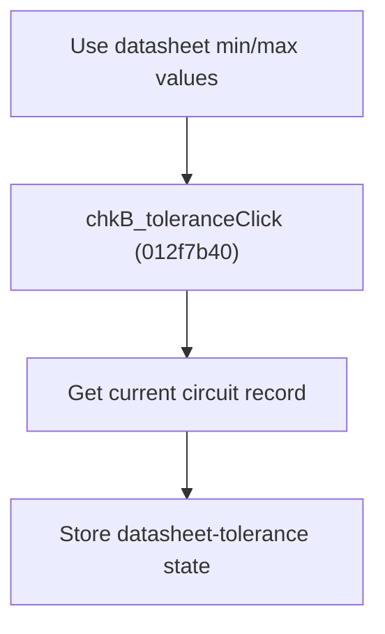

# Use Datasheet Min/Max Values

> Analysis status: Source reviewed for `TIARA-diz.6.7.1968`.

## Control

| Property | Recovered value |
| --- | --- |
| Form | frmModelTestBenchEditor |
| Component path | frmModelTestBenchEditor.pnlMain.pnlTestOptions.grB_localSettings.pctrl_localSettingst.ts_tolerance.chkB_tolerance |
| Control class | TCheckBox |
| Caption | Use datasheet min/max values |
| Hint | See Resource evidence below. |
| Handler name | chkB_toleranceClick |
| Handler address | 012f7b40 |
| Graph node | `resource:dfm:frmModelTestBenchEditor/frmModelTestBenchEditor.pnlMain.pnlTestOptions.grB_localSettings.pctrl_localSettingst.ts_tolerance.chkB_tolerance` |
| Handler node | `function:012f7b40` |
| Graph layer | UI |

## What happens when clicked

- Finds the per-circuit record for the current tree item.
- Writes the Use datasheet min/max values checked state to that record.
- The handler has no null or root-item guard. It does not change the numeric tolerance rows directly.

## Click flow

## Handler evidence

- Source: [FUN_012f7b40](../../../DecompiledSources/Tina16/functions/00000000012F7B40__FUN_012f7b40.c)
- Recovered role: Store the selected circuit's datasheet-tolerance option.
- The local tab also contains tolerance percent controls, but this check box has its own record field.
- FUN_012f7b40 maps the current node index to the record list and passes check box +0xA88 state to FUN_012e5390.

## Resource evidence

- Caption: `Use datasheet min/max values`.
- No extracted glyph is present for this control.
- Nearby labels, when cited above, are candidates from the same parent and are used only with handler evidence.

## Analysis limits

- No runtime UI test was performed.
- The explanation does not infer behavior from the caption, hint, or nearby labels alone.
