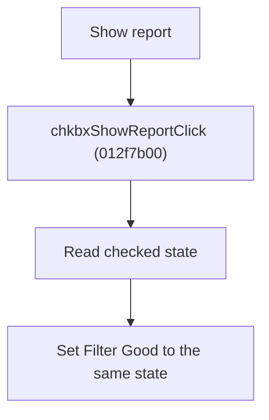

# Show Report

> Analysis status: Source reviewed for `TIARA-diz.6.7.1956`.

## Control

| Property | Recovered value |
| --- | --- |
| Form | frmModelTestBenchEditor |
| Component path | frmModelTestBenchEditor.pnlMain.pnlTestOptions.chkbxShowReport |
| Control class | TCheckBox |
| Caption | Show report |
| Hint | See Resource evidence below. |
| Handler name | chkbxShowReportClick |
| Handler address | 012f7b00 |
| Graph node | `resource:dfm:frmModelTestBenchEditor/frmModelTestBenchEditor.pnlMain.pnlTestOptions.chkbxShowReport` |
| Handler node | `function:012f7b00` |
| Graph layer | UI |

## What happens when clicked

- Reads the Show report checked state.
- Writes the same state to the Filter Good check box.
- The click handler does not write a per-circuit record. The normal save path later reads the control state into testbench XML.

## Click flow

## Handler evidence

- Source: [FUN_012f7b00](../../../DecompiledSources/Tina16/functions/00000000012F7B00__FUN_012f7b00.c)
- Recovered role: Keep the Filter Good option equal to the Show Report state.
- The resource marks Show report as initially checked.
- FUN_012f7b00 reads check box +0x730 and calls the checked-state setter on control +0x738 with the same value.

## Resource evidence

- Caption: `Show report`.
- No extracted glyph is present for this control.
- Nearby labels, when cited above, are candidates from the same parent and are used only with handler evidence.

## Analysis limits

- No runtime UI test was performed.
- The explanation does not infer behavior from the caption, hint, or nearby labels alone.
