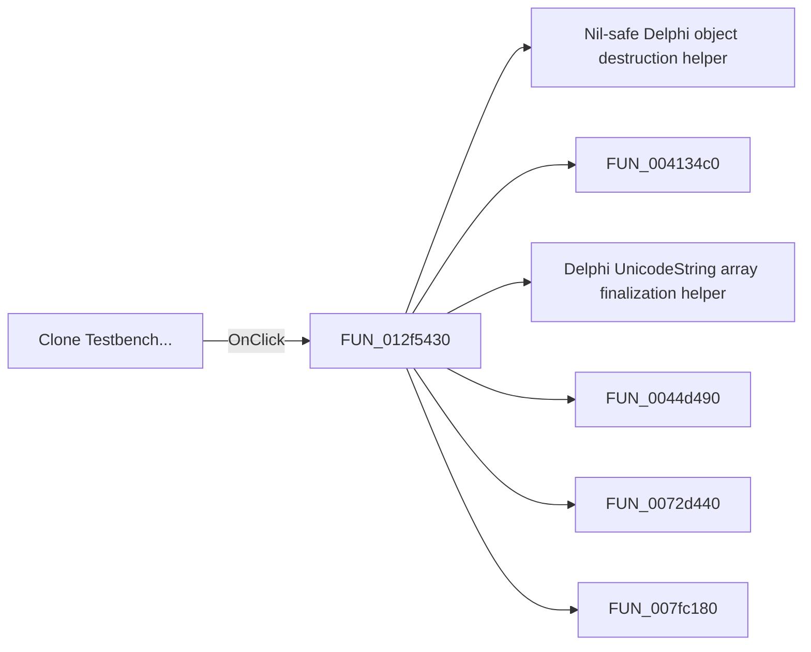

# Clone Testbench...

> Analysis status: Pending individual source review.

## Control

| Property | Recovered value |
| --- | --- |
| Form | frmModelTestBenchEditor |
| Component path | frmModelTestBenchEditor.TestBenchEditorMenu.mnFile.mnCloneTestbench |
| Control class | TMenuItem |
| Caption | Clone Testbench... |
| Hint | Not present in the recovered resource. |
| Text | Not present in the recovered resource. |
| Handler name | mnCloneTestbenchClick |
| Handler address | 012f5430 |
| Graph node | `resource:dfm:frmModelTestBenchEditor/frmModelTestBenchEditor.TestBenchEditorMenu.mnFile.mnCloneTestbench` |
| Handler node | `function:012f5430` |
| Graph layer | UI |

## What happens when clicked

Pending individual analysis. An agent must read the recovered handler source and its relevant callees before it replaces this text.

## Click flow

## Handler evidence

- Source: [DecompiledSources/Tina16/functions/00000000012F5430__FUN_012f5430.c](../../../DecompiledSources/Tina16/functions/00000000012F5430__FUN_012f5430.c)
- Recovered role: Not present in the recovered resource.
- Current graph summary: Handles 1 Delphi UI event: frmModelTestBenchEditor.TestBenchEditorMenu.mnFile.mnCloneTestbench.OnClick.
- Current graph behavior: Not present in the recovered resource.
- Current graph evidence: Not present in the recovered resource.
- Complexity: complex
- Distinct outgoing calls: 11

## Direct calls

- `function:00410f20` — Nil-safe Delphi object destruction helper
- `function:004134c0` — FUN_004134c0
- `function:00414560` — Delphi UnicodeString array finalization helper
- `function:0044d490` — FUN_0044d490
- `function:0072d440` — FUN_0072d440
- `function:007fc180` — FUN_007fc180
- `function:008059a0` — FUN_008059a0
- `function:0080cc70` — FUN_0080cc70
- `function:012e9e60` — FUN_012e9e60
- `function:012f4f80` — FUN_012f4f80
- `function:01b21190` — FUN_01b21190

## Resource evidence

- Kind: Not present in the recovered resource.
- Modal result: Not present in the recovered resource.
- Checked state: Not present in the recovered resource.
- List items: Not present in the recovered resource.
- Image reference: Not present in the recovered resource.
- Extracted glyph: None.

## Nearby label candidates

Nearby labels are layout candidates only. They are not proof of behavior.

- No same-parent label candidate is available.

## Analysis limits

- Do not infer behavior from the control class, caption, hint, glyph, or nearby label alone.
- Do not replace the pending status until the handler source and relevant call path provide enough evidence.
