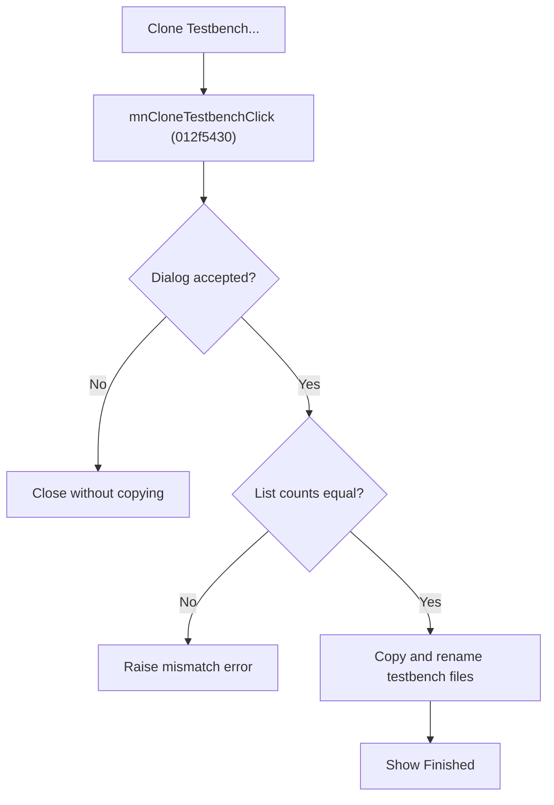

# Clone Testbench

> Analysis status: Source reviewed for `TIARA-diz.6.7.1938`.

## Control

| Property | Recovered value |
| --- | --- |
| Form | frmModelTestBenchEditor |
| Component path | frmModelTestBenchEditor.TestBenchEditorMenu.mnFile.mnCloneTestbench |
| Control class | TMenuItem |
| Caption | Clone Testbench... |
| Hint | See Resource evidence below. |
| Handler name | mnCloneTestbenchClick |
| Handler address | 012f5430 |
| Graph node | `resource:dfm:frmModelTestBenchEditor/frmModelTestBenchEditor.TestBenchEditorMenu.mnFile.mnCloneTestbench` |
| Handler node | `function:012f5430` |
| Graph layer | UI |

## What happens when clicked

- Opens the Clone TestBench dialog. Cancel closes the dialog without copying files.
- After acceptance, splits the target-prefix and circuit-folder fields into comma-separated lists. It requires equal item counts.
- For each pair, copies and renames .TSC, .CSV, .TSM, and .MTB files from the source folder. It can also copy .AC and .TR reference results when the INI option permits it.
- Shows a working form during the copy. A mismatched list or a missing required source type raises an error. A completed accepted operation shows Finished.

## Click flow

## Handler evidence

- Source: [FUN_012f5430](../../../DecompiledSources/Tina16/functions/00000000012F5430__FUN_012f5430.c)
- Recovered role: Open the clone-testbench dialog and copy accepted testbench files.
- The dialog labels identify source folder, source prefix, target prefix, and circuit folder inputs.
- FUN_012f5430 accepts only modal result 1, checks both list counts, and calls FUN_012f4f80 for each pair.
- FUN_012f4f80 applies the source and target prefixes and copies the recovered file types.
- Relevant callee: [FUN_012f4f80](../../../DecompiledSources/Tina16/functions/00000000012F4F80__FUN_012f4f80.c)

## Resource evidence

- Caption: `Clone Testbench...`.
- No extracted glyph is present for this control.
- Nearby labels, when cited above, are candidates from the same parent and are used only with handler evidence.

## Analysis limits

- No runtime UI test was performed.
- The explanation does not infer behavior from the caption, hint, or nearby labels alone.
