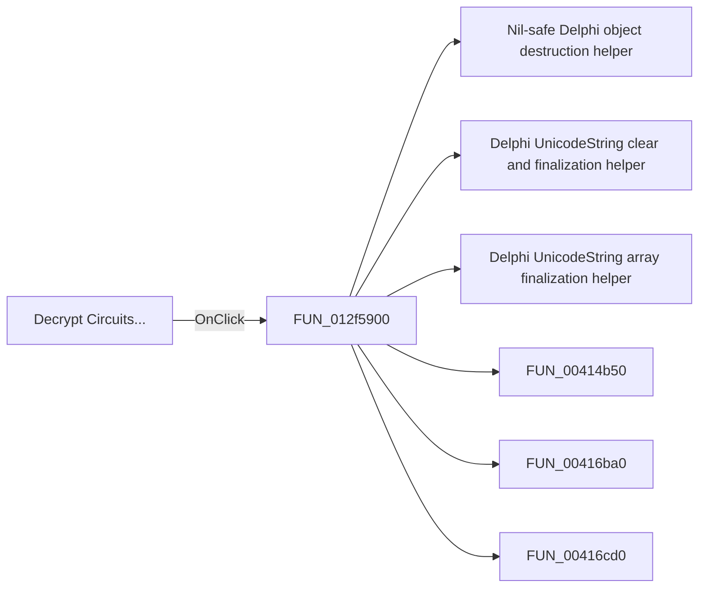

# Decrypt Circuits...

> Analysis status: Pending individual source review.

## Control

| Property | Recovered value |
| --- | --- |
| Form | frmModelTestBenchEditor |
| Component path | frmModelTestBenchEditor.TestBenchEditorMenu.mnFile.mnDecryptCircuits |
| Control class | TMenuItem |
| Caption | Decrypt Circuits... |
| Hint | Not present in the recovered resource. |
| Text | Not present in the recovered resource. |
| Handler name | mnDecryptCircuitsClick |
| Handler address | 012f5900 |
| Graph node | `resource:dfm:frmModelTestBenchEditor/frmModelTestBenchEditor.TestBenchEditorMenu.mnFile.mnDecryptCircuits` |
| Handler node | `function:012f5900` |
| Graph layer | UI |

## What happens when clicked

Pending individual analysis. An agent must read the recovered handler source and its relevant callees before it replaces this text.

## Click flow

## Handler evidence

- Source: [DecompiledSources/Tina16/functions/00000000012F5900__FUN_012f5900.c](../../../DecompiledSources/Tina16/functions/00000000012F5900__FUN_012f5900.c)
- Recovered role: Not present in the recovered resource.
- Current graph summary: Handles 1 Delphi UI event: frmModelTestBenchEditor.TestBenchEditorMenu.mnFile.mnDecryptCircuits.OnClick.
- Current graph behavior: Not present in the recovered resource.
- Current graph evidence: Not present in the recovered resource.
- Complexity: complex
- Distinct outgoing calls: 24

## Direct calls

- `function:00410f20` — Nil-safe Delphi object destruction helper
- `function:00414480` — Delphi UnicodeString clear and finalization helper
- `function:00414560` — Delphi UnicodeString array finalization helper
- `function:00414b50` — FUN_00414b50
- `function:00416ba0` — FUN_00416ba0
- `function:00416cd0` — FUN_00416cd0
- `function:00417580` — FUN_00417580
- `function:00417740` — FUN_00417740
- `function:00418590` — FUN_00418590
- `function:00441230` — FUN_00441230
- `function:00441290` — FUN_00441290
- `function:004412c0` — FUN_004412c0
- `function:00441920` — FUN_00441920
- `function:00442f70` — FUN_00442f70
- `function:007fc180` — FUN_007fc180
- `function:008059a0` — FUN_008059a0
- `function:0080cc70` — FUN_0080cc70
- `function:012ea610` — FUN_012ea610
- `function:012ea640` — FUN_012ea640
- `function:012f4ad0` — FUN_012f4ad0
- `function:012f5840` — FUN_012f5840
- `function:014a16d0` — FUN_014a16d0
- `function:014a74d0` — FUN_014a74d0
- `function:0198b200` — FUN_0198b200

## Resource evidence

- Kind: Not present in the recovered resource.
- Modal result: Not present in the recovered resource.
- Checked state: Not present in the recovered resource.
- List items: Not present in the recovered resource.
- Image reference: Not present in the recovered resource.
- Extracted glyph: None.

## Nearby label candidates

Nearby labels are layout candidates only. They are not proof of behavior.

- No same-parent label candidate is available.

## Analysis limits

- Do not infer behavior from the control class, caption, hint, glyph, or nearby label alone.
- Do not replace the pending status until the handler source and relevant call path provide enough evidence.
