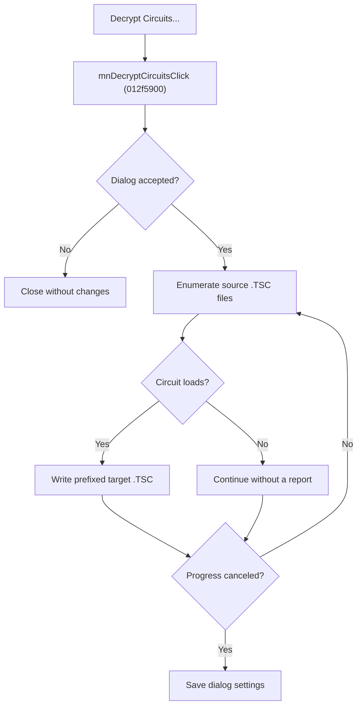

# Decrypt Circuits

> Analysis status: Source reviewed for `TIARA-diz.6.7.1939`.

## Control

| Property | Recovered value |
| --- | --- |
| Form | frmModelTestBenchEditor |
| Component path | frmModelTestBenchEditor.TestBenchEditorMenu.mnFile.mnDecryptCircuits |
| Control class | TMenuItem |
| Caption | Decrypt Circuits... |
| Hint | See Resource evidence below. |
| Handler name | mnDecryptCircuitsClick |
| Handler address | 012f5900 |
| Graph node | `resource:dfm:frmModelTestBenchEditor/frmModelTestBenchEditor.TestBenchEditorMenu.mnFile.mnDecryptCircuits` |
| Handler node | `function:012f5900` |
| Graph layer | UI |

## What happens when clicked

- Opens the Decrypt Circuits dialog. Cancel performs no batch work and does not save the dialog fields.
- After acceptance, enumerates source-folder .TSC files. Each file that loads successfully is written as a new target .TSC file with the accepted prefix.
- Updates a progress form and checks its cancel flag between files. Files already written stay on disk after cancellation.
- After normal completion or progress cancellation, saves the source folder, target folder, and target prefix in TINA.INI. It does not show a per-file failure report or a final summary.

## Click flow

## Handler evidence

- Source: [FUN_012f5900](../../../DecompiledSources/Tina16/functions/00000000012F5900__FUN_012f5900.c)
- Recovered role: Coordinate the accepted Decrypt Circuits batch and persist its settings.
- The dialog resource supplies source folder, target folder, target-prefix, and same-folder controls.
- FUN_012f5900 tests ShowModal for 1, enumerates source\\*.tsc, loads each circuit, builds target\\stem+prefix+.tsc, and writes successful loads.
- The handler reads the progress cancel byte between entries and writes DE_SourceFolder, DE_TargetFolder, and DE_TargetPrefix after the loop.

## Resource evidence

- Caption: `Decrypt Circuits...`.
- No extracted glyph is present for this control.
- Nearby labels, when cited above, are candidates from the same parent and are used only with handler evidence.

## Analysis limits

- No runtime UI test was performed.
- The explanation does not infer behavior from the caption, hint, or nearby labels alone.
