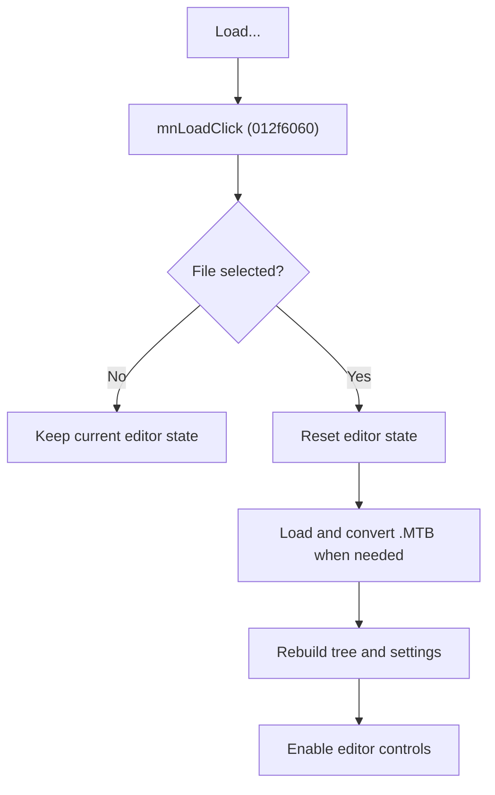

# Load Testbench

> Analysis status: Source reviewed for `TIARA-diz.6.7.1940`.

## Control

| Property | Recovered value |
| --- | --- |
| Form | frmModelTestBenchEditor |
| Component path | frmModelTestBenchEditor.TestBenchEditorMenu.mnFile.mnLoad |
| Control class | TMenuItem |
| Caption | Load... |
| Hint | See Resource evidence below. |
| Handler name | mnLoadClick |
| Handler address | 012f6060 |
| Graph node | `resource:dfm:frmModelTestBenchEditor/frmModelTestBenchEditor.TestBenchEditorMenu.mnFile.mnLoad` |
| Handler node | `function:012f6060` |
| Graph layer | UI |

## What happens when clicked

- Opens a file dialog for Model test bench (*.mtb). The initial folder comes from the saved TestBench setting.
- Cancel leaves the current editor state unchanged.
- After acceptance, resets the editor, loads the selected testbench, rebuilds its circuit tree and per-circuit settings, and enables the editing controls.
- The loader accepts the current XML format and invokes a converter when the file does not start with an XML declaration. A missing or invalid file does not produce a message in the recovered load path.

## Click flow

## Handler evidence

- Source: [FUN_012f6060](../../../DecompiledSources/Tina16/functions/00000000012F6060__FUN_012f6060.c)
- Recovered role: Load a selected model testbench file into the editor.
- FUN_012f6060 sets the dialog filter, derives the initial folder from TINA.INI, and tests the dialog result.
- Only the accepted branch calls FUN_012fa2c0 and FUN_012fb520.
- FUN_012fb520 reads testbench paths and options, resolves relative paths, rebuilds circuit state, and overrides the file timeout with Opt_Timeout from TINA.INI.
- Relevant callee: [FUN_012fa2c0](../../../DecompiledSources/Tina16/functions/00000000012FA2C0__FUN_012fa2c0.c)
- Relevant callee: [FUN_012fb520](../../../DecompiledSources/Tina16/functions/00000000012FB520__FUN_012fb520.c)

## Resource evidence

- Caption: `Load...`.
- No extracted glyph is present for this control.
- Nearby labels, when cited above, are candidates from the same parent and are used only with handler evidence.

## Analysis limits

- No runtime UI test was performed.
- The explanation does not infer behavior from the caption, hint, or nearby labels alone.
