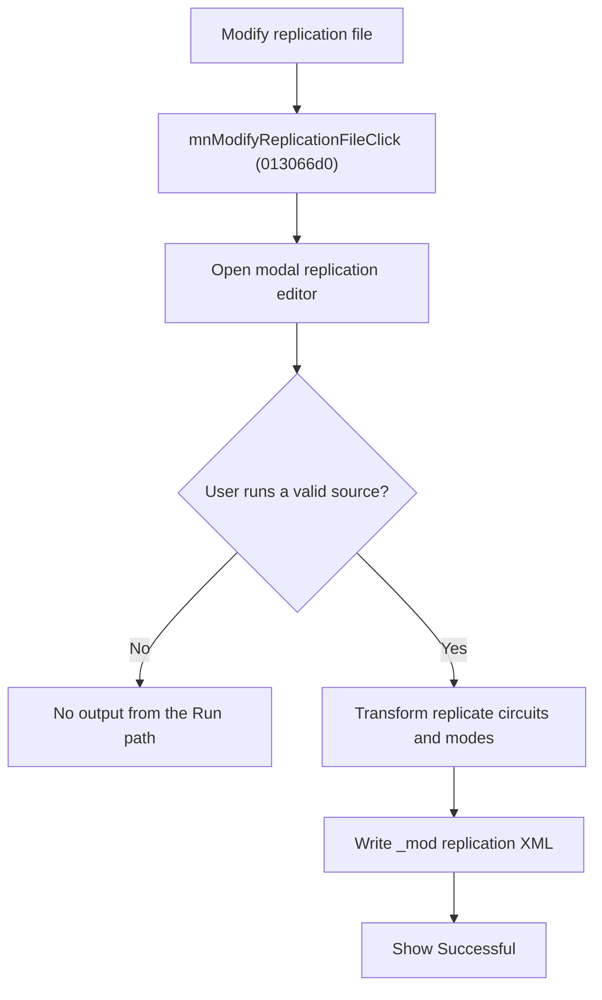

# Modify Replication File

> Analysis status: Source reviewed for `TIARA-diz.6.7.1944`.

## Control

| Property | Recovered value |
| --- | --- |
| Form | frmModelTestBenchEditor |
| Component path | frmModelTestBenchEditor.TestBenchEditorMenu.mnTools.mnModifyReplicationFile |
| Control class | TMenuItem |
| Caption | Modify replication file |
| Hint | See Resource evidence below. |
| Handler name | mnModifyReplicationFileClick |
| Handler address | 013066d0 |
| Graph node | `resource:dfm:frmModelTestBenchEditor/frmModelTestBenchEditor.TestBenchEditorMenu.mnTools.mnModifyReplicationFile` |
| Handler node | `function:013066d0` |
| Graph layer | UI |

## What happens when clicked

- Creates the Modify Replication File dialog and opens it modally.
- The menu handler does not inspect the modal result and does not modify the testbench editor state directly.
- Inside the dialog, Run loads a replicate XML source, applies selected working-mode and duplication transformations, writes a `_mod` replication file to the selected result folder or source folder, and shows a Successful notification.
- If the source does not exist or cannot be parsed, the recovered Run path does not write an output or show its success notification.

## Click flow

## Handler evidence

- Source: [FUN_013066d0](../../../DecompiledSources/Tina16/functions/00000000013066D0__FUN_013066d0.c)
- Recovered role: Open the replication-file modifier as a modal tool.
- FUN_013066d0 creates class PTR_FUN_012ea7a8, stores the form pointer, and calls ShowModal without a result branch.
- The ModReplicationFile resource identifies source file, result folder, duplicate mode, Efficiency, Line, Load, and VFM options.
- FUN_012eb240 loads `/replicate/circuit`, rewrites paths and XML nodes, saves a `_mod` document, and reports Successful only in the successful parse branch.
- Relevant callee: [FUN_012eb240](../../../DecompiledSources/Tina16/functions/00000000012EB240__FUN_012eb240.c)

## Resource evidence

- Caption: `Modify replication file`.
- No extracted glyph is present for this control.
- Nearby labels, when cited above, are candidates from the same parent and are used only with handler evidence.

## Analysis limits

- No runtime UI test was performed.
- The explanation does not infer behavior from the caption, hint, or nearby labels alone.
