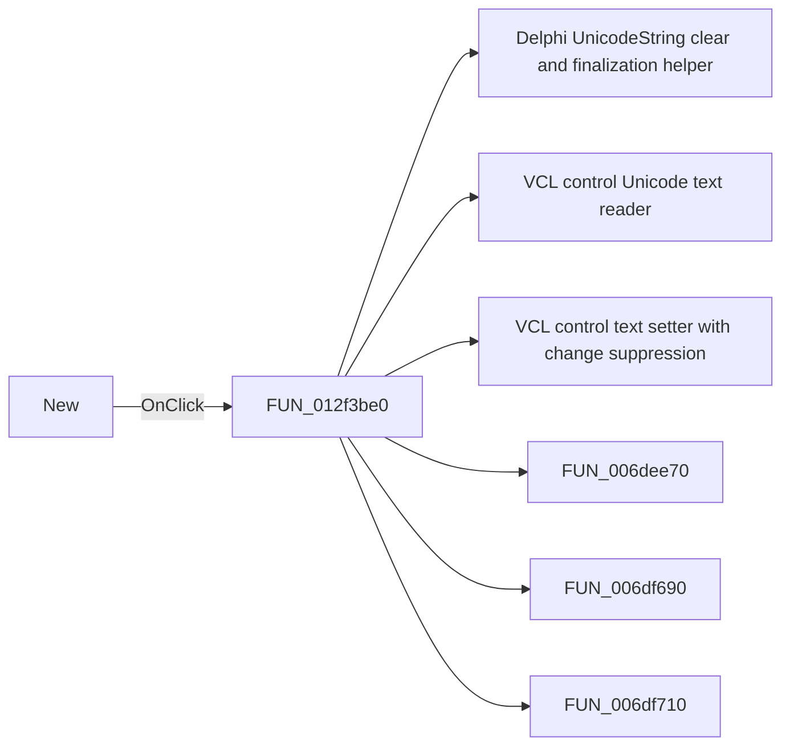

# New

> Analysis status: Pending individual source review.

## Control

| Property | Recovered value |
| --- | --- |
| Form | frmModelTestBenchEditor |
| Component path | frmModelTestBenchEditor.TestBenchEditorMenu.mnFile.mnNew |
| Control class | TMenuItem |
| Caption | New |
| Hint | Not present in the recovered resource. |
| Text | Not present in the recovered resource. |
| Handler name | mnNewClick |
| Handler address | 012f3be0 |
| Graph node | `resource:dfm:frmModelTestBenchEditor/frmModelTestBenchEditor.TestBenchEditorMenu.mnFile.mnNew` |
| Handler node | `function:012f3be0` |
| Graph layer | UI |

## What happens when clicked

Pending individual analysis. An agent must read the recovered handler source and its relevant callees before it replaces this text.

## Click flow

## Handler evidence

- Source: [DecompiledSources/Tina16/functions/00000000012F3BE0__FUN_012f3be0.c](../../../DecompiledSources/Tina16/functions/00000000012F3BE0__FUN_012f3be0.c)
- Recovered role: Not present in the recovered resource.
- Current graph summary: Handles 1 Delphi UI event: frmModelTestBenchEditor.TestBenchEditorMenu.mnFile.mnNew.OnClick.
- Current graph behavior: Not present in the recovered resource.
- Current graph evidence: Not present in the recovered resource.
- Complexity: complex
- Distinct outgoing calls: 17

## Direct calls

- `function:00414480` — Delphi UnicodeString clear and finalization helper
- `function:0064dd90` — VCL control Unicode text reader
- `function:0064de00` — VCL control text setter with change suppression
- `function:006dee70` — FUN_006dee70
- `function:006df690` — FUN_006df690
- `function:006df710` — FUN_006df710
- `function:006e1e60` — FUN_006e1e60
- `function:006e23c0` — FUN_006e23c0
- `function:006e24b0` — FUN_006e24b0
- `function:00b96980` — FUN_00b96980
- `function:012ddec0` — FUN_012ddec0
- `function:012f2410` — FUN_012f2410
- `function:012fa2c0` — FUN_012fa2c0
- `function:012fafd0` — FUN_012fafd0
- `function:01303240` — FUN_01303240
- `function:013039b0` — FUN_013039b0
- `function:01303ee0` — FUN_01303ee0

## Resource evidence

- Kind: Not present in the recovered resource.
- Modal result: Not present in the recovered resource.
- Checked state: Not present in the recovered resource.
- List items: Not present in the recovered resource.
- Image reference: Not present in the recovered resource.
- Extracted glyph: None.

## Nearby label candidates

Nearby labels are layout candidates only. They are not proof of behavior.

- No same-parent label candidate is available.

## Analysis limits

- Do not infer behavior from the control class, caption, hint, glyph, or nearby label alone.
- Do not replace the pending status until the handler source and relevant call path provide enough evidence.
