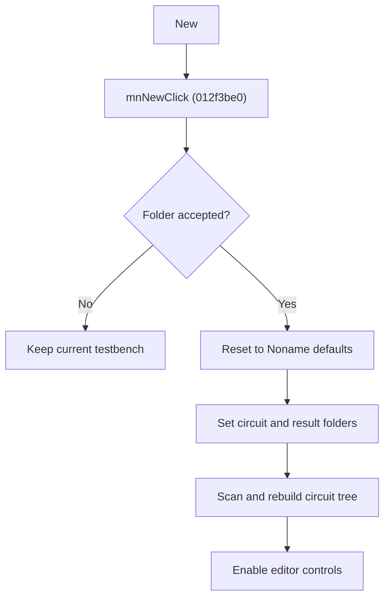

# New Testbench

> Analysis status: Source reviewed for `TIARA-diz.6.7.1941`.

## Control

| Property | Recovered value |
| --- | --- |
| Form | frmModelTestBenchEditor |
| Component path | frmModelTestBenchEditor.TestBenchEditorMenu.mnFile.mnNew |
| Control class | TMenuItem |
| Caption | New |
| Hint | See Resource evidence below. |
| Handler name | mnNewClick |
| Handler address | 012f3be0 |
| Graph node | `resource:dfm:frmModelTestBenchEditor/frmModelTestBenchEditor.TestBenchEditorMenu.mnFile.mnNew` |
| Handler node | `function:012f3be0` |
| Graph layer | UI |

## What happens when clicked

- Starts with the current circuit-folder text and opens the recovered folder/text selection dialog.
- Cancel keeps the current testbench unchanged.
- After acceptance, resets the editor to its defaults, assigns the selected folder as both the circuit folder and result folder, clears the old tree and model state, and scans the folder to build a new circuit tree.
- The new testbench name is Noname. Default values include 1024 samples, one thread, and a zero timeout.

## Click flow

## Handler evidence

- Source: [FUN_012f3be0](../../../DecompiledSources/Tina16/functions/00000000012F3BE0__FUN_012f3be0.c)
- Recovered role: Create a new testbench from an accepted circuit folder.
- FUN_012f3be0 performs all reset and rebuild calls only after FUN_00b96980 reports acceptance.
- FUN_012fa2c0 clears saved paths and models and writes the recovered default values.
- The handler creates a root tree item, calls FUN_012fafd0 to scan, then enables the editing controls.
- Relevant callee: [FUN_012fa2c0](../../../DecompiledSources/Tina16/functions/00000000012FA2C0__FUN_012fa2c0.c)
- Relevant callee: [FUN_012fafd0](../../../DecompiledSources/Tina16/functions/00000000012FAFD0__FUN_012fafd0.c)

## Resource evidence

- Caption: `New`.
- No extracted glyph is present for this control.
- Nearby labels, when cited above, are candidates from the same parent and are used only with handler evidence.

## Analysis limits

- No runtime UI test was performed.
- The explanation does not infer behavior from the caption, hint, or nearby labels alone.
