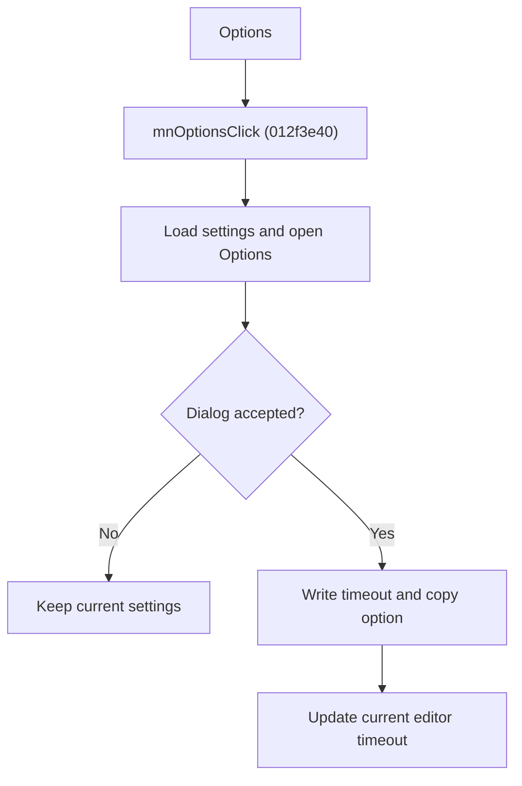

# Model Test Options

> Analysis status: Source reviewed for `TIARA-diz.6.7.1945`.

## Control

| Property | Recovered value |
| --- | --- |
| Form | frmModelTestBenchEditor |
| Component path | frmModelTestBenchEditor.TestBenchEditorMenu.mnTools.mnOptions |
| Control class | TMenuItem |
| Caption | Options |
| Hint | See Resource evidence below. |
| Handler name | mnOptionsClick |
| Handler address | 012f3e40 |
| Graph node | `resource:dfm:frmModelTestBenchEditor/frmModelTestBenchEditor.TestBenchEditorMenu.mnTools.mnOptions` |
| Handler node | `function:012f3e40` |
| Graph layer | UI |

## What happens when clicked

- Opens the Options dialog with Timeout and Copy RefResults values loaded from TINA.INI.
- Cancel leaves both settings unchanged.
- After acceptance, writes Opt_Timeout to TINA.INI, copies the timeout into the current editor, and writes Opt_CopyRefResults.
- The dialog OK handler parses the timeout text as an integer. A conversion failure is not caught in the recovered handler.

## Click flow

## Handler evidence

- Source: [FUN_012f3e40](../../../DecompiledSources/Tina16/functions/00000000012F3E40__FUN_012f3e40.c)
- Recovered role: Edit and persist model-test timeout and reference-copy options.
- The ModelTestOptions resource contains the Timeout label and Copy RefResults check box.
- FUN_012e9740 loads both settings on form show; FUN_012e96a0 stages them on OK.
- FUN_012f3e40 commits both values only when ShowModal returns 1.
- Relevant callee: [FUN_012e9740](../../../DecompiledSources/Tina16/functions/00000000012E9740__FUN_012e9740.c)
- Relevant callee: [FUN_012e96a0](../../../DecompiledSources/Tina16/functions/00000000012E96A0__FUN_012e96a0.c)

## Resource evidence

- Caption: `Options`.
- No extracted glyph is present for this control.
- Nearby labels, when cited above, are candidates from the same parent and are used only with handler evidence.

## Analysis limits

- No runtime UI test was performed.
- The explanation does not infer behavior from the caption, hint, or nearby labels alone.
