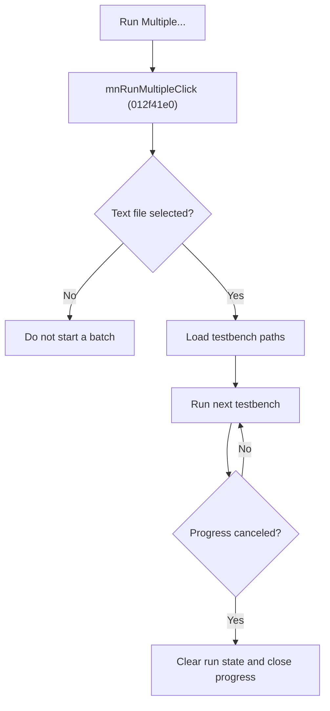

# Run Multiple Testbenches

> Analysis status: Source reviewed for `TIARA-diz.6.7.1946`.

## Control

| Property | Recovered value |
| --- | --- |
| Form | frmModelTestBenchEditor |
| Component path | frmModelTestBenchEditor.TestBenchEditorMenu.mnTools.mnRunMultiple |
| Control class | TMenuItem |
| Caption | Run Multiple... |
| Hint | See Resource evidence below. |
| Handler name | mnRunMultipleClick |
| Handler address | 012f41e0 |
| Graph node | `resource:dfm:frmModelTestBenchEditor/frmModelTestBenchEditor.TestBenchEditorMenu.mnTools.mnRunMultiple` |
| Handler node | `function:012f41e0` |
| Graph layer | UI |

## What happens when clicked

- Opens a file dialog for a text file. Cancel starts no tests.
- Loads each line as one testbench path, shows a progress form, and calls the recovered single-testbench runner for each line.
- Updates progress, processes UI messages, and waits 200 ms between entries. The progress cancel flag stops the loop between testbenches.
- Destroys the progress form and clears the global run flag after the loop. It does not show a final success or failure summary.

## Click flow

## Handler evidence

- Source: [FUN_012f41e0](../../../DecompiledSources/Tina16/functions/00000000012F41E0__FUN_012f41e0.c)
- Recovered role: Run testbench paths from an accepted text file.
- FUN_012f41e0 configures the `Text file (*.txt)|*.txt` filter and tests the dialog result.
- The accepted branch loads the file into a string list and calls FUN_012f3f60(line, 1) in a cancel-aware loop.
- The handler writes `Multiple run end` on exit and clears the global byte at run-object offset +0x98.
- Relevant callee: [FUN_012f3f60](../../../DecompiledSources/Tina16/functions/00000000012F3F60__FUN_012f3f60.c)

## Resource evidence

- Caption: `Run Multiple...`.
- No extracted glyph is present for this control.
- Nearby labels, when cited above, are candidates from the same parent and are used only with handler evidence.

## Analysis limits

- No runtime UI test was performed.
- The explanation does not infer behavior from the caption, hint, or nearby labels alone.
