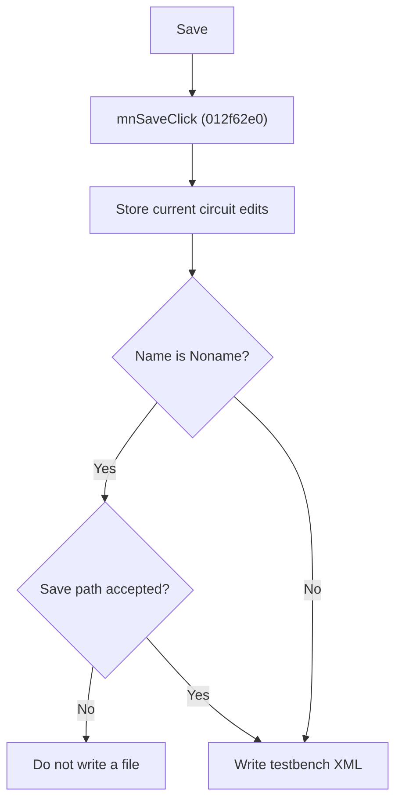

# Save Testbench

> Analysis status: Source reviewed for `TIARA-diz.6.7.1942`.

## Control

| Property | Recovered value |
| --- | --- |
| Form | frmModelTestBenchEditor |
| Component path | frmModelTestBenchEditor.TestBenchEditorMenu.mnFile.mnSave |
| Control class | TMenuItem |
| Caption | Save |
| Hint | See Resource evidence below. |
| Handler name | mnSaveClick |
| Handler address | 012f62e0 |
| Graph node | `resource:dfm:frmModelTestBenchEditor/frmModelTestBenchEditor.TestBenchEditorMenu.mnFile.mnSave` |
| Handler node | `function:012f62e0` |
| Graph layer | UI |

## What happens when clicked

- First stores edits from the current circuit into the in-memory testbench.
- If the testbench name is not Noname, writes the testbench XML to its current path without a file dialog.
- For a Noname testbench, opens the save dialog. Cancel stops the file write.
- The XML includes folders, data filename, report and result options, test mode, thread options, timeout, version, simulation mode, manufacturer, circuits, and per-circuit settings.

## Click flow

## Handler evidence

- Source: [FUN_012f62e0](../../../DecompiledSources/Tina16/functions/00000000012F62E0__FUN_012f62e0.c)
- Recovered role: Save the model testbench to its current file or request a file for a new testbench.
- FUN_012f62e0 calls FUN_012fc960 with mode 0.
- FUN_012fc960 asks for a path in mode 0 only when the current name equals Noname. It updates the saved path and caption only after dialog acceptance.
- The same routine builds and writes the complete testbench XML document.
- Relevant callee: [FUN_012fc960](../../../DecompiledSources/Tina16/functions/00000000012FC960__FUN_012fc960.c)

## Resource evidence

- Caption: `Save`.
- No extracted glyph is present for this control.
- Nearby labels, when cited above, are candidates from the same parent and are used only with handler evidence.

## Analysis limits

- No runtime UI test was performed.
- The explanation does not infer behavior from the caption, hint, or nearby labels alone.
