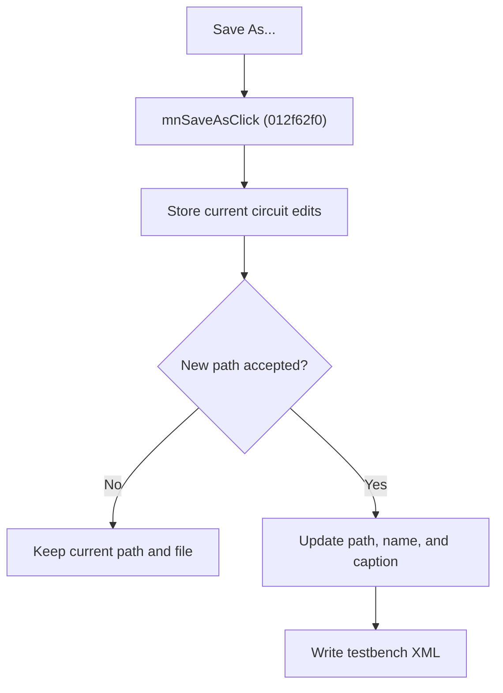

# Save Testbench As

> Analysis status: Source reviewed for `TIARA-diz.6.7.1943`.

## Control

| Property | Recovered value |
| --- | --- |
| Form | frmModelTestBenchEditor |
| Component path | frmModelTestBenchEditor.TestBenchEditorMenu.mnFile.mnSaveAs |
| Control class | TMenuItem |
| Caption | Save As... |
| Hint | See Resource evidence below. |
| Handler name | mnSaveAsClick |
| Handler address | 012f62f0 |
| Graph node | `resource:dfm:frmModelTestBenchEditor/frmModelTestBenchEditor.TestBenchEditorMenu.mnFile.mnSaveAs` |
| Handler node | `function:012f62f0` |
| Graph layer | UI |

## What happens when clicked

- First stores edits from the current circuit into the in-memory testbench.
- Always opens the save dialog, even when the testbench already has a file.
- Cancel leaves the current saved path and file unchanged.
- After acceptance, updates the saved path, testbench name, and form caption, then writes the full testbench XML.

## Click flow

## Handler evidence

- Source: [FUN_012f62f0](../../../DecompiledSources/Tina16/functions/00000000012F62F0__FUN_012f62f0.c)
- Recovered role: Save the model testbench to a newly selected file.
- FUN_012f62f0 calls FUN_012fc960 with mode 1.
- Mode 1 always enters the save-dialog branch. The routine changes the current path only after acceptance.
- The XML writer is shared with Save and includes global and per-circuit settings.
- Relevant callee: [FUN_012fc960](../../../DecompiledSources/Tina16/functions/00000000012FC960__FUN_012fc960.c)

## Resource evidence

- Caption: `Save As...`.
- No extracted glyph is present for this control.
- Nearby labels, when cited above, are candidates from the same parent and are used only with handler evidence.

## Analysis limits

- No runtime UI test was performed.
- The explanation does not infer behavior from the caption, hint, or nearby labels alone.
