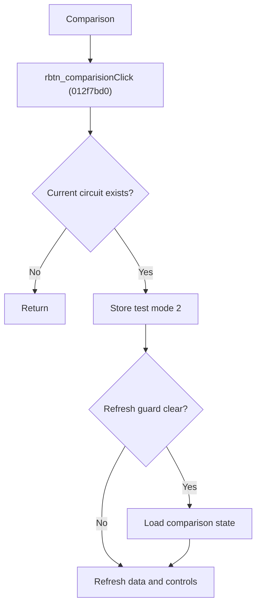

# Compare Circuit Results

> Analysis status: Source reviewed for `TIARA-diz.6.7.1975`.

## Control

| Property | Recovered value |
| --- | --- |
| Form | frmModelTestBenchEditor |
| Component path | frmModelTestBenchEditor.pnlMain.pnlTestOptions.grB_testSettings.rbtn_comparision |
| Control class | TRadioButton |
| Caption | Comparison |
| Hint | See Resource evidence below. |
| Handler name | rbtn_comparisionClick |
| Handler address | 012f7bd0 |
| Graph node | `resource:dfm:frmModelTestBenchEditor/frmModelTestBenchEditor.pnlMain.pnlTestOptions.grB_testSettings.rbtn_comparision` |
| Handler node | `function:012f7bd0` |
| Graph layer | UI |

## What happens when clicked

- If the current tree item maps to a circuit record, writes test-mode code 2.
- For a circuit item, can load its comparison result state when the form guard permits it.
- Then refreshes the data display, local settings, and test-setting controls. It initializes reference data when the record has none.
- A missing item or root item produces no record change.

## Click flow

## Handler evidence

- Source: [FUN_012f7bd0](../../../DecompiledSources/Tina16/functions/00000000012F7BD0__FUN_012f7bd0.c)
- Recovered role: Set the current circuit test mode to Comparison and refresh its data.
- The control caption and its dedicated handler provide the mode meaning.
- FUN_012f7bd0 writes code 2 through FUN_012e5850 and conditionally calls FUN_01301140 for a circuit item.
- The non-guarded branch calls the data and control refresh routines and can call FUN_013060b0.

## Resource evidence

- Caption: `Comparison`.
- No extracted glyph is present for this control.
- Nearby labels, when cited above, are candidates from the same parent and are used only with handler evidence.

## Analysis limits

- No runtime UI test was performed.
- The explanation does not infer behavior from the caption, hint, or nearby labels alone.
