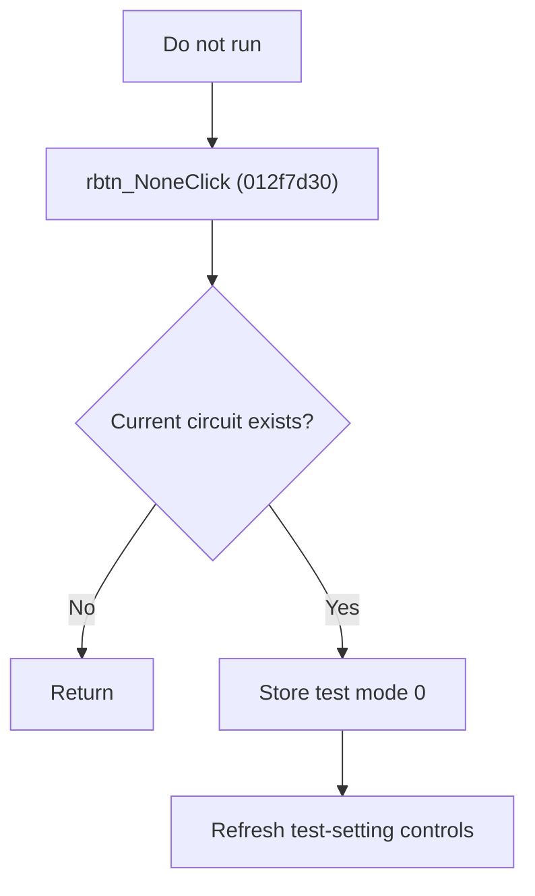

# Do Not Run Circuit

> Analysis status: Source reviewed for `TIARA-diz.6.7.1973`.

## Control

| Property | Recovered value |
| --- | --- |
| Form | frmModelTestBenchEditor |
| Component path | frmModelTestBenchEditor.pnlMain.pnlTestOptions.grB_testSettings.rbtn_None |
| Control class | TRadioButton |
| Caption | Do not run |
| Hint | See Resource evidence below. |
| Handler name | rbtn_NoneClick |
| Handler address | 012f7d30 |
| Graph node | `resource:dfm:frmModelTestBenchEditor/frmModelTestBenchEditor.pnlMain.pnlTestOptions.grB_testSettings.rbtn_None` |
| Handler node | `function:012f7d30` |
| Graph layer | UI |

## What happens when clicked

- If the current tree item maps to a circuit record, writes test-mode code 0.
- Refreshes the test-setting control state.
- A missing item or root item produces no record change.

## Click flow

## Handler evidence

- Source: [FUN_012f7d30](../../../DecompiledSources/Tina16/functions/00000000012F7D30__FUN_012f7d30.c)
- Recovered role: Set the current circuit test mode to Do not run.
- The control caption and its dedicated handler provide the mode meaning.
- FUN_012f7d30 requires a selected node with a positive circuit index, calls FUN_012e5850(record, 0), then FUN_01306350.

## Resource evidence

- Caption: `Do not run`.
- No extracted glyph is present for this control.
- Nearby labels, when cited above, are candidates from the same parent and are used only with handler evidence.

## Analysis limits

- No runtime UI test was performed.
- The explanation does not infer behavior from the caption, hint, or nearby labels alone.
