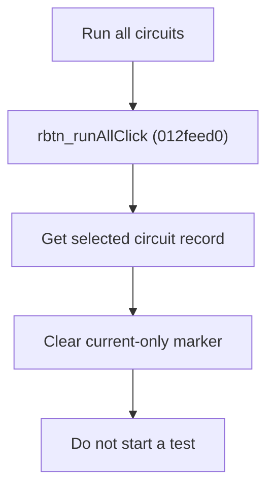

# Run All Circuits

> Analysis status: Source reviewed for `TIARA-diz.6.7.1977`.

## Control

| Property | Recovered value |
| --- | --- |
| Form | frmModelTestBenchEditor |
| Component path | frmModelTestBenchEditor.pnlMain.pnlTestOptions.rbtn_runAll |
| Control class | TRadioButton |
| Caption | Run all circuits |
| Hint | See Resource evidence below. |
| Handler name | rbtn_runAllClick |
| Handler address | 012feed0 |
| Graph node | `resource:dfm:frmModelTestBenchEditor/frmModelTestBenchEditor.pnlMain.pnlTestOptions.rbtn_runAll` |
| Handler node | `function:012feed0` |
| Graph layer | UI |

## What happens when clicked

- Gets the record for the current circuit and clears its current-only run marker.
- It does not start a test and does not iterate all records.
- The companion Run current circuit handler first clears this marker on all records and then sets it on the selected record. Returning to Run all circuits clears the selected marker.
- The handler has no null or root-item guard; the surrounding UI must keep a valid circuit selected.

## Click flow

## Handler evidence

- Source: [FUN_012feed0](../../../DecompiledSources/Tina16/functions/00000000012FEED0__FUN_012feed0.c)
- Recovered role: Clear the current-only run marker for the selected circuit.
- The radio caption defines the user-visible scope.
- FUN_012feed0 maps the selected tree node to one record and calls FUN_012e5830(record, 0).
- FUN_012fef10 confirms that record byte +9 is the current-only marker by clearing all records before it sets one to 1.

## Resource evidence

- Caption: `Run all circuits`.
- No extracted glyph is present for this control.
- Nearby labels, when cited above, are candidates from the same parent and are used only with handler evidence.

## Analysis limits

- No runtime UI test was performed.
- The explanation does not infer behavior from the caption, hint, or nearby labels alone.
