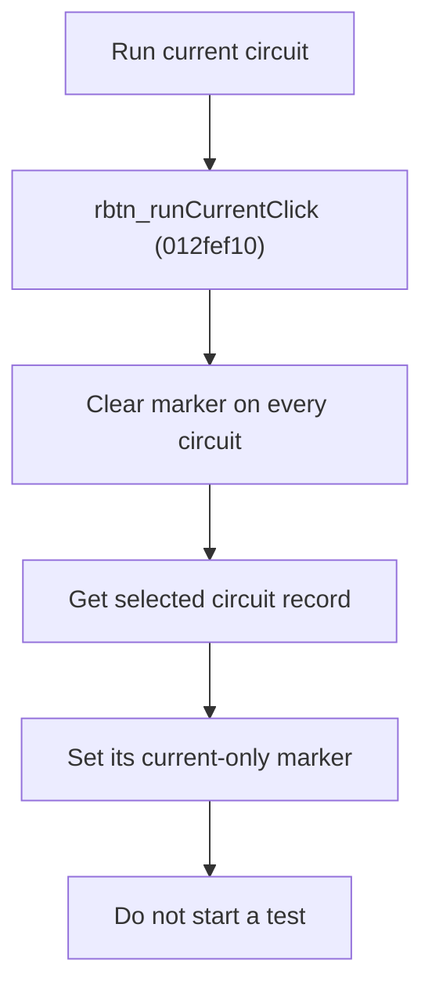

# Run Current Circuit

> Analysis status: Source reviewed for `TIARA-diz.6.7.1978`.

## Control

| Property | Recovered value |
| --- | --- |
| Form | frmModelTestBenchEditor |
| Component path | frmModelTestBenchEditor.pnlMain.pnlTestOptions.rbtn_runCurrent |
| Control class | TRadioButton |
| Caption | Run current circuit |
| Hint | See Resource evidence below. |
| Handler name | rbtn_runCurrentClick |
| Handler address | 012fef10 |
| Graph node | `resource:dfm:frmModelTestBenchEditor/frmModelTestBenchEditor.pnlMain.pnlTestOptions.rbtn_runCurrent` |
| Handler node | `function:012fef10` |
| Graph layer | UI |

## What happens when clicked

- Clears the current-only run marker on every circuit record.
- Then sets that marker on the current circuit record.
- It does not start a test. Start test later consumes the stored scope.
- The final selected-record lookup has no null or root-item guard; the surrounding UI must keep a valid circuit selected.

## Click flow

## Handler evidence

- Source: [FUN_012fef10](../../../DecompiledSources/Tina16/functions/00000000012FEF10__FUN_012fef10.c)
- Recovered role: Mark only the selected circuit for the next current-circuit run.
- The radio caption defines the user-visible scope.
- FUN_012fef10 iterates the record list and calls FUN_012e5830(record, 0), then calls FUN_012e5830(selectedRecord, 1).
- FUN_012e5830 writes record byte +9 only.

## Resource evidence

- Caption: `Run current circuit`.
- No extracted glyph is present for this control.
- Nearby labels, when cited above, are candidates from the same parent and are used only with handler evidence.

## Analysis limits

- No runtime UI test was performed.
- The explanation does not infer behavior from the caption, hint, or nearby labels alone.
