# Add

> Analysis status: Reviewed from recovered source.

## Control

| Property | Recovered value |
| --- | --- |
| Form | frmParamEditor |
| Component path | frmParamEditor.pnlButtons.btnAdd |
| Control class | TButton |
| Caption | Add |
| Hint | Not present in the recovered resource. |
| Text | Not present in the recovered resource. |
| Handler name | btnAddClick |
| Handler address | 0143bc50 |
| Graph node | `resource:dfm:frmParamEditor/frmParamEditor.pnlButtons.btnAdd` |
| Handler node | `function:0143bc50` |
| Graph layer | UI |

## What happens when clicked

The handler inserts one empty row after the selected grid row. It first sets a
form-owned update guard. It then moves each later row down by one position,
increases the row count, clears the name and value cells in the new row, and
sets the row's third-column flag. Finally, it refreshes the grid, gives focus to
the grid, and clears the update guard.

The handler does not validate, save, or commit the parameter list. It does not
close the editor. Its recovered path has no error-message branch.

## Click flow

```mermaid
flowchart LR
    addClick["Click Add"] --> addHandler["btnAddClick"]
    addHandler --> guardOn["Set the grid-update guard"]
    guardOn --> moveRows["Move later rows down by one"]
    moveRows --> addRow["Increase the row count"]
    addRow --> clearCells["Clear the new name and value cells"]
    clearCells --> setFlag["Set the new row flag"]
    setFlag --> refreshGrid["Refresh and focus the grid"]
    refreshGrid --> guardOff["Clear the grid-update guard"]
```

## Handler evidence

- Source: [DecompiledSources/Tina16/functions/000000000143BC50__FUN_0143bc50.c](../../../DecompiledSources/Tina16/functions/000000000143BC50__FUN_0143bc50.c)
- Recovered role: Inserts an empty parameter row after the selected row.
- Current graph summary: Handles 1 Delphi UI event: frmParamEditor.pnlButtons.btnAdd.OnClick.
- Current graph behavior: Moves later grid rows down, adds and clears one row, sets its third-column flag, and refreshes the grid.
- Current graph evidence: `FUN_0143bc50` reads the grid row count and selected row at offsets `+0x4E0` and `+0x4AC`. It copies rows with `FUN_0084e3c0` and `FUN_0084e4d0`, increases the count with `FUN_00848a70`, clears columns 0 and 1 with `FUN_0084e3e0`, and sets column 2 through `FUN_0143d630`.
- Complexity: complex
- Distinct outgoing calls: 6

## Direct calls

- `function:00848a70` — FUN_00848a70
- `function:0084e3c0` — FUN_0084e3c0
- `function:0084e3e0` — FUN_0084e3e0
- `function:0084e4d0` — FUN_0084e4d0
- `function:00f02610` — FUN_00f02610
- `function:0143d630` — FUN_0143d630

## Resource evidence

- Kind: Not present in the recovered resource.
- Modal result: Not present in the recovered resource.
- Checked state: Not present in the recovered resource.
- List items: Not present in the recovered resource.
- Image reference: Not present in the recovered resource.
- Extracted glyph: None.

## Nearby label candidates

Nearby labels are layout candidates only. They are not proof of behavior.

- No same-parent label candidate is available.

## Analysis limits

- The recovered source does not identify a Delphi name for the third-column flag.
- No glyph or nearby-label evidence is available for this control.
