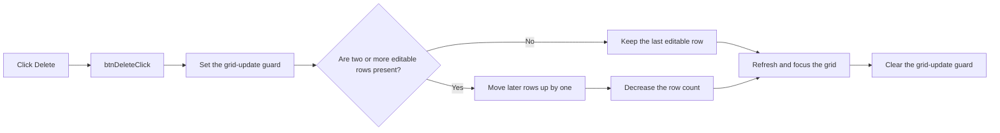

# Delete

> Analysis status: Reviewed from recovered source.

## Control

| Property | Recovered value |
| --- | --- |
| Form | frmParamEditor |
| Component path | frmParamEditor.pnlButtons.btnDelete |
| Control class | TButton |
| Caption | Delete |
| Hint | Not present in the recovered resource. |
| Text | Not present in the recovered resource. |
| Handler name | btnDeleteClick |
| Handler address | 0143bd70 |
| Graph node | `resource:dfm:frmParamEditor/frmParamEditor.pnlButtons.btnDelete` |
| Handler node | `function:0143bd70` |
| Graph layer | UI |

## What happens when clicked

The handler removes the selected parameter row only when more than one editable
row exists. It sets a form-owned update guard, moves each later row up by one
position, and decreases the grid row count. It then refreshes the grid, gives
focus to the grid, and clears the update guard.

When only one editable row remains, the handler keeps that row and only runs the
refresh and focus operations. It does not validate, save, commit, or close the
editor. Its recovered path has no error-message branch.

## Click flow

## Handler evidence

- Source: [DecompiledSources/Tina16/functions/000000000143BD70__FUN_0143bd70.c](../../../DecompiledSources/Tina16/functions/000000000143BD70__FUN_0143bd70.c)
- Recovered role: Deletes the selected parameter row while preserving one editable row.
- Current graph summary: Handles 1 Delphi UI event: frmParamEditor.pnlButtons.btnDelete.OnClick.
- Current graph behavior: Moves later rows up and reduces the row count when more than one editable row exists, then refreshes and focuses the grid.
- Current graph evidence: `FUN_0143bd70` compares the grid's fixed-row count at `+0x4C0` with `RowCount - 1`. On the allowed branch, it copies later rows with `FUN_0084e3c0` and `FUN_0084e4d0` and calls `FUN_00848a70` with the reduced count.
- Complexity: complex
- Distinct outgoing calls: 4

## Direct calls

- `function:00848a70` — FUN_00848a70
- `function:0084e3c0` — FUN_0084e3c0
- `function:0084e4d0` — FUN_0084e4d0
- `function:00f02610` — FUN_00f02610

## Resource evidence

- Kind: Not present in the recovered resource.
- Modal result: Not present in the recovered resource.
- Checked state: Not present in the recovered resource.
- List items: Not present in the recovered resource.
- Image reference: Not present in the recovered resource.
- Extracted glyph: None.

## Nearby label candidates

Nearby labels are layout candidates only. They are not proof of behavior.

- No same-parent label candidate is available.

## Analysis limits

- The handler relies on the grid to keep the selected-row index valid.
- No glyph or nearby-label evidence is available for this control.
