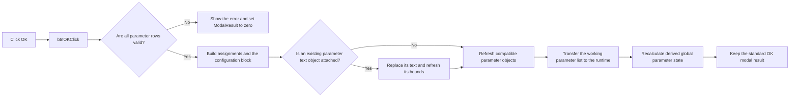

# btnOK

> Analysis status: Reviewed from recovered source.

## Control

| Property | Recovered value |
| --- | --- |
| Form | frmParamEditor |
| Component path | frmParamEditor.pnlButton1.btnOK |
| Control class | TBitBtn |
| Caption | Not present in the recovered resource. |
| Hint | Not present in the recovered resource. |
| Text | Not present in the recovered resource. |
| Handler name | btnOKClick |
| Handler address | 0143b640 |
| Graph node | `resource:dfm:frmParamEditor/frmParamEditor.pnlButton1.btnOK` |
| Handler node | `function:0143b640` |
| Graph layer | UI |

## What happens when clicked

The handler validates every editable row. Validation rejects an empty name or
value, a reserved name, a duplicate name, a name that does not start with a
letter, and a name that contains a character other than a letter, digit, or
underscore. The validator displays the applicable error message. On failure,
the handler sets the form's modal result to zero, so the standard `bkOK` action
does not close the editor.

After successful validation, the handler rebuilds the parameter text and the
form-owned parameter string list. Each grid row becomes a name-and-value
assignment. The third-column row flag decides whether the assignment is a
visible line or belongs in a block delimited by `@ Configuration begin` and
`.@ Configuration end`. If the editor is attached to an existing schematic
text object, the handler replaces that object's text and refreshes its former
and new drawing bounds. It then refreshes other compatible parameter objects in
the open document.

The successful path transfers the form's working parameter-object list to the
current application runtime and clears the form's pointer to that list. It also
recalculates a global aggregate from a numeric field in each parameter object
and copies the first object to a global current-parameter record when the list
is not empty. The exact business names of that aggregate and record are not
recovered. The standard `bkOK` modal result then closes the editor.

## Click flow

## Handler evidence

- Source: [DecompiledSources/Tina16/functions/000000000143B640__FUN_0143b640.c](../../../DecompiledSources/Tina16/functions/000000000143B640__FUN_0143b640.c)
- Recovered role: Validates and commits the edited global parameter set.
- Current graph summary: Handles 1 Delphi UI event: frmParamEditor.pnlButton1.btnOK.OnClick.
- Current graph behavior: Validates all rows, rebuilds parameter text, updates existing parameter objects, transfers the working parameter objects to runtime state, and recalculates derived global state.
- Current graph evidence: `FUN_0143b640` gates the commit on `FUN_0143ca80` and writes zero to form offset `+0x508` on failure. On success, it reads grid columns through `FUN_0084e320`, reads the third-column flag through `FUN_0143d610`, updates the attached object at `+0x738` through `FUN_0149ec30`, calls `FUN_0143d700`, replaces the runtime list at `+0x470` with the form list at `+0x730`, and derives global values from each copied parameter object.
- Complexity: complex
- Distinct outgoing calls: 16

## Direct calls

- `function:00410f20` — Nil-safe Delphi object destruction helper
- `function:00414480` — Delphi UnicodeString clear and finalization helper
- `function:00414560` — Delphi UnicodeString array finalization helper
- `function:00416cd0` — FUN_00416cd0
- `function:0043ea00` — FUN_0043ea00
- `function:004aeac0` — FUN_004aeac0
- `function:004b6930` — FUN_004b6930
- `function:0084e320` — FUN_0084e320
- `function:00b957c0` — FUN_00b957c0
- `function:0143ca80` — FUN_0143ca80
- `function:0143d610` — FUN_0143d610
- `function:0143d700` — FUN_0143d700
- `function:0149ec30` — FUN_0149ec30
- `function:019a4600` — FUN_019a4600
- `function:019af700` — FUN_019af700
- `function:01d0f8a0` — FUN_01d0f8a0

## Resource evidence

- Kind: bkOK
- Modal result: Not present in the recovered resource.
- Checked state: Not present in the recovered resource.
- List items: Not present in the recovered resource.
- Image reference: Not present in the recovered resource.
- Extracted glyph: None.

## Nearby label candidates

Nearby labels are layout candidates only. They are not proof of behavior.

- No same-parent label candidate is available.

## Analysis limits

- Four reserved-name constants do not have recovered text. The source also names `TEMP`, `TIME`, `GMIN`, `RNDR`, and `RNDC` explicitly.
- The recovered source does not identify Delphi names for the third-column flag, the derived aggregate, or the copied global record.
- No glyph or nearby-label evidence is available for this control.
