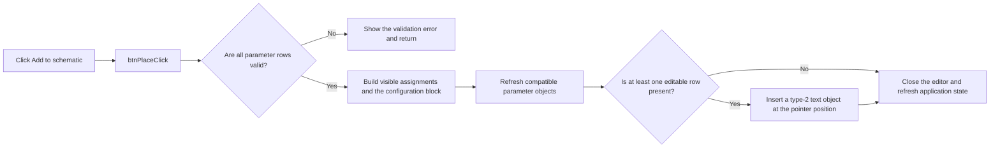

# Add to schematic

> Analysis status: Reviewed from recovered source.

## Control

| Property | Recovered value |
| --- | --- |
| Form | frmParamEditor |
| Component path | frmParamEditor.pnlButtons.btnPlace |
| Control class | TButton |
| Caption | Add to schematic |
| Hint | Not present in the recovered resource. |
| Text | Not present in the recovered resource. |
| Handler name | btnPlaceClick |
| Handler address | 0143be30 |
| Graph node | `resource:dfm:frmParamEditor/frmParamEditor.pnlButtons.btnPlace` |
| Handler node | `function:0143be30` |
| Graph layer | UI |

## What happens when clicked

The handler first validates every editable row. Validation rejects an empty name
or value, a reserved name, a duplicate name, a name that does not start with a
letter, and a name that contains a character other than a letter, digit, or
underscore. The validator displays the applicable error message and stops the
operation when a check fails.

After successful validation, the handler rebuilds the parameter text. Each row
becomes a name-and-value assignment. The third-column row flag decides whether
the assignment is a visible line or belongs in a block delimited by
`@ Configuration begin` and `.@ Configuration end`. It refreshes compatible
parameter objects already in the open document. When the grid contains at least
one editable row, it creates and inserts a type-2 text object into the active
schematic, marks the schematic as changed, and positions the object at the
current pointer location. It then closes the editor and refreshes application
state.

Validation failure is a no-op after the error message. The handler does not
insert a partial object or close the editor on that branch.

## Click flow

## Handler evidence

- Source: [DecompiledSources/Tina16/functions/000000000143BE30__FUN_0143be30.c](../../../DecompiledSources/Tina16/functions/000000000143BE30__FUN_0143be30.c)
- Recovered role: Validates parameter rows and inserts their formatted text into the active schematic.
- Current graph summary: Handles 1 Delphi UI event: frmParamEditor.pnlButtons.btnPlace.OnClick.
- Current graph behavior: Validates the grid, builds visible assignments and a configuration block, refreshes compatible parameter objects, inserts a type-2 schematic text object when rows exist, and closes the editor.
- Current graph evidence: `FUN_0143be30` gates all work on `FUN_0143ca80`, reads each grid row with `FUN_0084e320`, reads the third-column flag through `FUN_0143d610`, adds the configuration delimiters, calls `FUN_0143d700`, calls `FUN_01c9c910` with subtype 2 when `RowCount > 1`, and closes through `FUN_00805200`.
- Complexity: complex
- Distinct outgoing calls: 13

## Direct calls

- `function:00410f20` — Nil-safe Delphi object destruction helper
- `function:00414480` — Delphi UnicodeString clear and finalization helper
- `function:00414560` — Delphi UnicodeString array finalization helper
- `function:00416cd0` — FUN_00416cd0
- `function:0043ea00` — FUN_0043ea00
- `function:004b6930` — FUN_004b6930
- `function:00805200` — FUN_00805200
- `function:0084e320` — FUN_0084e320
- `function:0143ca80` — FUN_0143ca80
- `function:0143d610` — FUN_0143d610
- `function:0143d700` — FUN_0143d700
- `function:019af700` — FUN_019af700
- `function:01c9c910` — FUN_01c9c910

## Resource evidence

- Kind: Not present in the recovered resource.
- Modal result: Not present in the recovered resource.
- Checked state: Not present in the recovered resource.
- List items: Not present in the recovered resource.
- Image reference: Not present in the recovered resource.
- Extracted glyph: None.

## Nearby label candidates

Nearby labels are layout candidates only. They are not proof of behavior.

- No same-parent label candidate is available.

## Analysis limits

- Four reserved-name constants do not have recovered text. The source also names `TEMP`, `TIME`, `GMIN`, `RNDR`, and `RNDC` explicitly.
- The recovered source does not identify a Delphi name for the third-column flag.
- No glyph or nearby-label evidence is available for this control.
