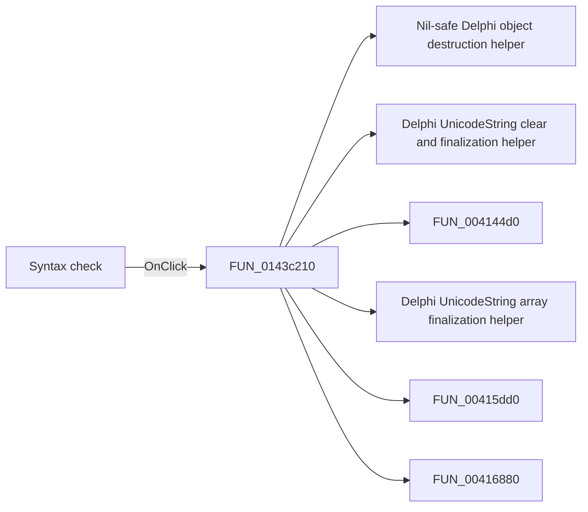

# Syntax check

> Analysis status: Pending individual source review.

## Control

| Property | Recovered value |
| --- | --- |
| Form | frmParamEditor |
| Component path | frmParamEditor.pnlButtons.btnSyntaxCheck |
| Control class | TButton |
| Caption | Syntax check |
| Hint | Not present in the recovered resource. |
| Text | Not present in the recovered resource. |
| Handler name | btnSyntaxCheckClick |
| Handler address | 0143c210 |
| Graph node | `resource:dfm:frmParamEditor/frmParamEditor.pnlButtons.btnSyntaxCheck` |
| Handler node | `function:0143c210` |
| Graph layer | UI |

## What happens when clicked

Pending individual analysis. An agent must read the recovered handler source and its relevant callees before it replaces this text.

## Click flow

## Handler evidence

- Source: [DecompiledSources/Tina16/functions/000000000143C210__FUN_0143c210.c](../../../DecompiledSources/Tina16/functions/000000000143C210__FUN_0143c210.c)
- Recovered role: Not present in the recovered resource.
- Current graph summary: Handles 1 Delphi UI event: frmParamEditor.pnlButtons.btnSyntaxCheck.OnClick.
- Current graph behavior: Not present in the recovered resource.
- Current graph evidence: Not present in the recovered resource.
- Complexity: complex
- Distinct outgoing calls: 28

## Direct calls

- `function:00410f20` — Nil-safe Delphi object destruction helper
- `function:00414480` — Delphi UnicodeString clear and finalization helper
- `function:004144d0` — FUN_004144d0
- `function:00414560` — Delphi UnicodeString array finalization helper
- `function:00415dd0` — FUN_00415dd0
- `function:00416880` — FUN_00416880
- `function:00416910` — FUN_00416910
- `function:0043e130` — FUN_0043e130
- `function:00456a50` — FUN_00456a50
- `function:004b3cf0` — Delphi string-list name getter
- `function:004b5390` — Delphi string-list value getter
- `function:004b6930` — FUN_004b6930
- `function:0084e320` — FUN_0084e320
- `function:013fd880` — FUN_013fd880
- `function:0143ca80` — FUN_0143ca80
- `function:016a61f0` — FUN_016a61f0
- `function:016a6a40` — FUN_016a6a40
- `function:016a9290` — FUN_016a9290
- `function:01779a20` — FUN_01779a20
- `function:0177aa70` — FUN_0177aa70
- `function:0177ae90` — FUN_0177ae90
- `function:0177aee0` — FUN_0177aee0
- `function:0177b033` — FUN_0177b033
- `function:01c8a330` — FUN_01c8a330
- `function:01d04d50` — FUN_01d04d50
- `function:01d34560` — FUN_01d34560
- `function:01d347d0` — FUN_01d347d0
- `function:01d34d40` — FUN_01d34d40

## Resource evidence

- Kind: Not present in the recovered resource.
- Modal result: Not present in the recovered resource.
- Checked state: Not present in the recovered resource.
- List items: Not present in the recovered resource.
- Image reference: Not present in the recovered resource.
- Extracted glyph: None.

## Nearby label candidates

Nearby labels are layout candidates only. They are not proof of behavior.

- No same-parent label candidate is available.

## Analysis limits

- Do not infer behavior from the control class, caption, hint, glyph, or nearby label alone.
- Do not replace the pending status until the handler source and relevant call path provide enough evidence.
